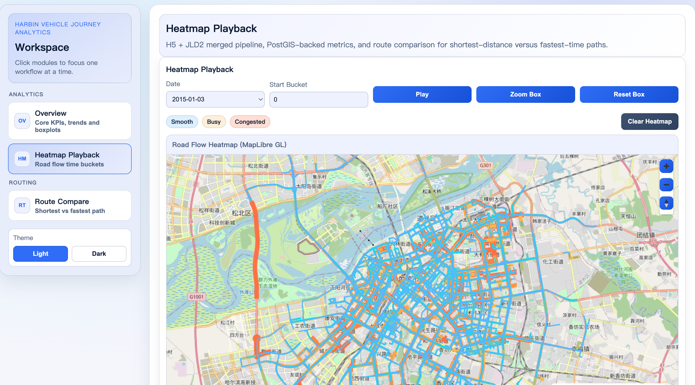

# 哈尔滨车辆行程分析平台（V1）

本项目用于哈尔滨车辆轨迹数据分析，包含数据入仓、统计聚合、热力图回放与路径对比能力。

## 截图





## 功能概览

- H5 + JLD2 数据入仓 PostgreSQL/PostGIS
- 每日统计指标、里程/速度箱线图
- 道路热力图分时回放
- 最短路径与最快路径对比

## 技术栈

- 后端：FastAPI、SQLAlchemy、PostgreSQL、PostGIS、pgRouting
- 前端：React、TypeScript、Vite、MapLibre GL、Recharts
- 数据流程：Python + ETL 脚本

## 新人启动手册（直接按下面做）

### 1) 前置条件

- 已安装 Docker（Docker Desktop 或 Docker Engine）
- 已安装 Git
- 已安装 `7z`（用于解压原始数据包）
- 能访问 Docker Hub（`registry-1.docker.io`），或已配置镜像加速器

macOS 安装 `7z`：

```bash
brew install p7zip
```

### 2) 拉代码

```bash
git clone https://github.com/your-org/data_platform.git
cd data_platform
```

### 3) 准备原始数据

默认主数据下载地址（Google Drive，ZIP；解压后目录为 `deepgtt-h5/`，包含 5 个 `*.h5`）：

`https://drive.usercontent.google.com/download?id=1tdgarnn28CM01o9hbeKLUiJ1o1lskrqA&export=download&authuser=0&confirm=t&uuid=2481bd7f-f21f-42a5-bb24-a8067a17356f&at=AGN2oQ3yy0IH0i35n6R_CZShxh3Y%3A1773114478451`

第二份数据下载地址（Google Drive，7z；解压后目录为 `jldpath/`，包含 5 个 `*.jld2`，你补全后替换）：

`https://drive.google.com/file/d/16tHtR6McxzQYGAP_B4rO9nPRMMOuvfXH/view?usp=sharing`

执行数据准备脚本（会下载、解压并把 `*.h5` 放到 `data/`、`*.jld2` 放到 `jldpath/`）：

```bash
make data-prepare
```

可通过环境变量覆盖下载地址：

```bash
DATA_ARCHIVE_URL_MAIN="<你的主数据zip链接>" \
DATA_ARCHIVE_URL_EXTRA="<你的补充数据7z链接>" \
make data-prepare
```

说明：

- 主数据压缩格式默认按 `zip` 处理（可通过 `DATA_ARCHIVE_FORMAT_MAIN` 覆盖）
- 补充数据压缩格式默认按 `7z` 处理（可通过 `DATA_ARCHIVE_FORMAT_EXTRA` 覆盖）
- 数据脚本会严格校验目录结构：必须有 `deepgtt-h5/` 与 `jldpath/`
- 数据脚本会清理旧的 `*.h5` / `*.jld2` 后再复制，避免混入历史文件
- 默认期望至少 5 个 `*.h5` 与 5 个 `*.jld2`（可用 `EXPECTED_H5_COUNT` / `EXPECTED_JLD2_COUNT` 覆盖）

### 4) 一键启动服务

```bash
./scripts/start.sh
```

启动逻辑（默认 `START_MODE=auto`）：

- 若检测到已存在数据库卷（`*_postgres_data`），仅启动前端服务（更快复用已准备数据）。
- 若未检测到数据库卷，启动完整服务栈（postgres + backend + frontend）。

说明：当前实现以“数据库卷存在”作为“数据库已准备好数据”的判定代理条件。

可手动指定启动模式：

```bash
# 强制完整流程
START_MODE=full ./scripts/start.sh

# 强制仅前端
START_MODE=frontend ./scripts/start.sh
```

若你已预拉取镜像且网络受限，可跳过 Docker Hub 可达性检查：

```bash
SKIP_REGISTRY_CHECK=1 ./scripts/start.sh
```

启动后访问：

- `START_MODE=full` 或 `START_MODE=auto` 且无数据库卷：
  - 前端：http://localhost:5173
  - 后端：http://localhost:8000
  - 接口文档：http://localhost:8000/docs
- `START_MODE=frontend` 或 `START_MODE=auto` 且有数据库卷：
  - 前端：http://localhost:5173

停止服务：

```bash
./scripts/stop.sh
```

## 手动启动（可选）

```bash
# 全量服务（postgres + backend + frontend）
docker compose up -d

# 仅前端（不自动拉起 backend/postgres）
docker compose up -d --no-deps frontend

docker compose ps
docker compose down
```

补充：`docker-compose.yml` 已配置 `restart: unless-stopped`，Docker daemon 重启后会自动恢复已启动服务。

若地图底图空白（通常是网络无法访问 OSM 瓦片）：

- 前端地图依赖瓦片服务 `VITE_MAP_TILES`（默认 OSM）。
- 在受限网络下请在 `frontend/.env` 中改为可访问的瓦片地址（支持逗号分隔多地址）。
- 修改后重建并重启前端：`docker compose build frontend && docker compose up -d frontend`。

## Docker 日常操作建议

```bash
# 首次初始化/需要后端接口时
START_MODE=full ./scripts/start.sh

# 日常只看前端页面（复用已有数据）
./scripts/start.sh

# 查看服务状态与日志
docker compose ps
docker compose logs -f frontend
docker compose logs -f backend

# 单服务重启（代码或配置更新后常用）
docker compose restart frontend
docker compose restart backend

# 完整停止（保留数据库卷）
./scripts/stop.sh

# 清空数据库并重建（慎用）
docker compose down -v
START_MODE=full ./scripts/start.sh
```

## 入仓执行（可选）

```bash
cd backend
uv run python -m app.etl.load_data --base-dir /Users/apple/data_platform --mode rebuild
```

常用模式说明：

- `rebuild`：全量重建（清空后重入仓 + 路网入仓模块 + 统计聚合），首次初始化使用。
- `refresh`：复用已入仓的 `trips/trip_segments`，只刷新路网映射与统计聚合，日常推荐。
- `compute`：只刷新统计聚合。

Docker 内执行（推荐，路径固定）：

```bash
# 首次全量
docker compose exec -T backend uv run python -m app.etl.load_data --base-dir / --mode rebuild

# 全量入仓中断后/已有明细数据时，走快速刷新
docker compose exec -T backend uv run python -m app.etl.load_data --base-dir / --mode refresh
```

若遇到历史卡死的 `running` 任务（常见于中断重跑）：

```bash
docker compose exec -T postgres psql -U postgres -d harbin_traffic -c "SELECT id,status,run_type,started_at,finished_at FROM ingest_runs ORDER BY id DESC LIMIT 10;"
```

新版本会在启动新任务时自动把历史 `pipeline_*` 的 `running` 记录标记为失败（stale），避免误判状态。

`table_row_stats` 说明：

- 刷新时会先 `ANALYZE` 关键表。
- 对关键展示表（`daily_*`、`heatmap_bins`、`road_speed_bins`、`ingest_road_map`）使用真实 `COUNT(*)` 写入。
- 避免新构建后短时间出现 `0` 的误判。

## 测试命令

```bash
make test
make test-backend
make test-frontend
make smoke
```

## 文档收口说明

为避免文档分散，日常使用优先看本 README：

- 启动、数据准备、排障、命令入口都在本文件。
- `QUICKSTART.md` 与 `DEPLOYMENT.md` 内容已并入本 README。

保留的专题文档：

- `spec.md`：架构原则与边界
- `implementation_guide.md`：实施总纲
- `project_context.md`：运行上下文
- `test_system.md`：测试体系
