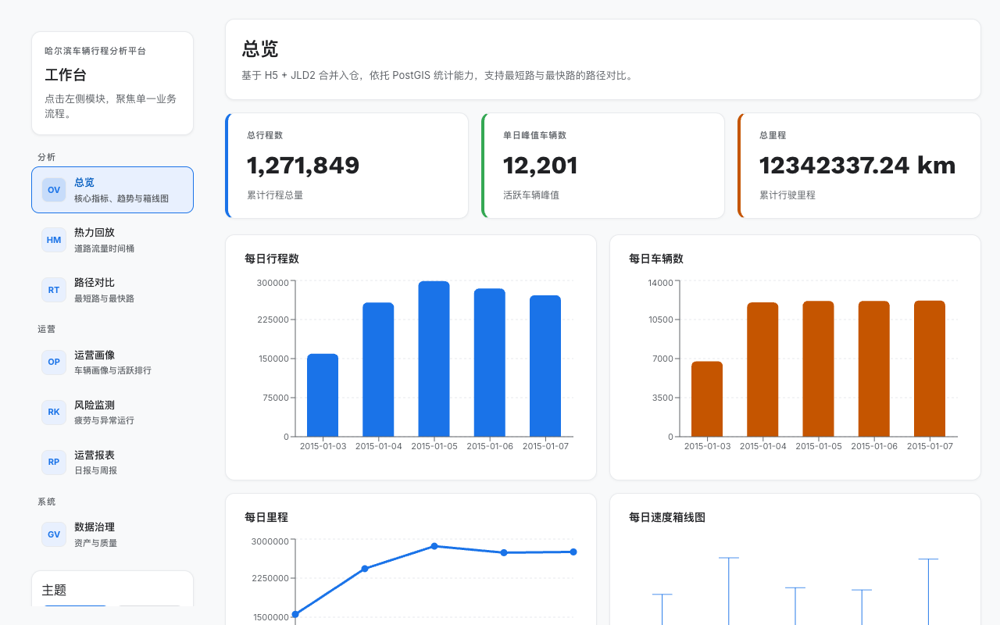
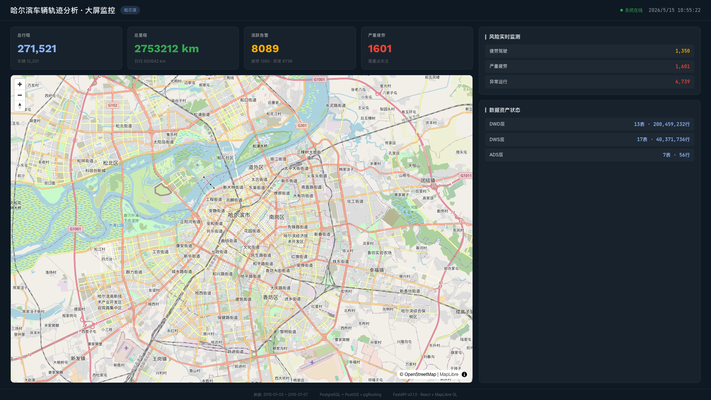

# 哈尔滨车辆行程分析平台（V1）

本项目用于哈尔滨车辆轨迹数据分析，包含数据入仓、统计聚合、热力图回放、路径对比、运营画像、风险监测、运营报表、数据治理与大屏监控。

## 截图





## 前端界面

- 主工作台：`http://localhost:5173` — 左侧 3 组导航（分析 / 运营 / 系统），7 个功能页面，深色/浅色主题切换
- 大屏监控：`http://localhost:5173/bigscreen.html` — 独立全屏仪表盘，实时 KPI + MapLibre 地图 + 风险/资产面板 + 30s 自动刷新

## 功能概览

- H5 + JLD2 数据入仓 PostgreSQL/PostGIS
- 每日统计指标、里程/速度箱线图、小时聚合、道路日统计
- 道路热力图分时回放 + 车辆轨迹回放
- 最短路径与最快路径对比（pgRouting）
- 运营画像：车辆画像、标签、活跃排行、常跑路段
- 风险监测：疲劳驾驶 24h 评估、异常长时间运行、夜间高风险
- 运营报表：日报、周报
- 数据治理：资产目录、质量检查、任务状态追踪

## 技术栈

- 后端：FastAPI、SQLAlchemy、PostgreSQL、PostGIS、pgRouting
- 前端：React、TypeScript、Vite、MapLibre GL、Recharts
- 数据流程：Python + ETL 脚本

## 新人启动手册（直接按下面做）

### 1) 前置条件

- 已安装 Docker（Docker Desktop 或 Docker Engine）
- 已安装 Git
- 已安装 `7z`（用于解压原始数据包）
- 能访问 Docker Hub（`registry-1.docker.io`），或已配置镜像加速器

macOS 安装 `7z`：

```bash
brew install p7zip
```

### 2) 拉代码

```bash
git clone https://github.com/your-org/data_platform.git
cd data_platform
```

### 3) 准备原始数据

默认主数据下载地址（Google Drive，ZIP；解压后目录为 `deepgtt-h5/`，包含 5 个 `*.h5`）：

`https://drive.usercontent.google.com/download?id=1tdgarnn28CM01o9hbeKLUiJ1o1lskrqA&export=download&authuser=0&confirm=t&uuid=2481bd7f-f21f-42a5-bb24-a8067a17356f&at=AGN2oQ3yy0IH0i35n6R_CZShxh3Y%3A1773114478451`

第二份数据下载地址（Google Drive，7z；解压后目录为 `jldpath/`，包含 5 个 `*.jld2`，你补全后替换）：

`https://drive.google.com/file/d/16tHtR6McxzQYGAP_B4rO9nPRMMOuvfXH/view?usp=sharing`

执行数据准备脚本（会下载、解压并把 `*.h5` 放到 `data/`、`*.jld2` 放到 `jldpath/`）：

```bash
./scripts/prepare_data.sh
```

可通过环境变量覆盖下载地址：

```bash
DATA_ARCHIVE_URL_MAIN="<你的主数据zip链接>" \
DATA_ARCHIVE_URL_EXTRA="<你的补充数据7z链接>" \
./scripts/prepare_data.sh
```

说明：

- 主数据压缩格式默认按 `zip` 处理（可通过 `DATA_ARCHIVE_FORMAT_MAIN` 覆盖）
- 补充数据压缩格式默认按 `7z` 处理（可通过 `DATA_ARCHIVE_FORMAT_EXTRA` 覆盖）
- 数据脚本会严格校验目录结构：必须有 `deepgtt-h5/` 与 `jldpath/`
- 数据脚本会清理旧的 `*.h5` / `*.jld2` 后再复制，避免混入历史文件
- 默认期望至少 5 个 `*.h5` 与 5 个 `*.jld2`（可用 `EXPECTED_H5_COUNT` / `EXPECTED_JLD2_COUNT` 覆盖）

### 4) 一键启动服务

```bash
./scripts/start.sh
```

启动逻辑（默认 `START_MODE=auto`）：

1. 前后端都在运行时，直接跳过，只提示已在运行并显示前端地址。
2. 仅后端在运行时，只启动前端。
3. 后端不在运行时，启动完整服务栈（postgres + backend + frontend）。这里的“完整”只表示把三个容器拉起来，不会重建、清空或重新导入数据库。

显式模式含义：

- `START_MODE=full`：启动 postgres + backend + frontend，但不做数据库重建/清空/导入。
- `START_MODE=frontend`：只启动 frontend，不动 backend/postgres。

如果前端提示 `Failed to fetch`，先检查 `backend` 是否也已启动。前端默认请求 `http://localhost:8000/api/v1`，只开前端时接口不存在，就会报这个错。

可手动指定启动模式：

```bash
# 强制完整流程
START_MODE=full ./scripts/start.sh

# 强制仅前端
START_MODE=frontend ./scripts/start.sh
```

若你已预拉取镜像且网络受限，可跳过 Docker Hub 可达性检查：

```bash
SKIP_REGISTRY_CHECK=1 ./scripts/start.sh
```

启动后访问：

- `START_MODE=full` 或 `START_MODE=auto` 且后端不在运行：
   - 前端：http://localhost:5173
   - 后端：http://localhost:8000
   - 接口文档：http://localhost:8000/docs
- `START_MODE=frontend` 或 `START_MODE=auto` 且后端已在运行：
   - 前端：http://localhost:5173

停止服务：

```bash
./scripts/stop.sh
```

## 统一部署（推荐）

`deploy.sh` 封装了从数据检查到服务启动的全链路：

```bash
# 从0开始的完整部署（首次使用）→ 5 步流程
./scripts/deploy.sh --fresh

# 自动判断当前状态继续（日常使用）
./scripts/deploy.sh --auto

# 强制刷新指定模块
./scripts/deploy.sh --module stats       # 统计
./scripts/deploy.sh --module ops         # 画像
./scripts/deploy.sh --module risk        # 风险
./scripts/deploy.sh --module report      # 报表
./scripts/deploy.sh --module governance  # 治理
./scripts/deploy.sh --module all         # 全部模块（按依赖）
./scripts/deploy.sh --module rebuild     # 完整重建（清库重来）
```

Makefile 快捷方式：

```bash
make rebuild                   # 完整重建
make deploy-fresh              # 从0开始
make deploy-auto               # 自动判断
make deploy-module MODULE=risk # 指定模块
```

`--fresh` 的流程：
1. **环境检查**：Docker + H5/JLD2 数据文件
2. **启动 PostgreSQL** + 后端容器
3. **全量入仓 + 计算**（pipeline 自行保证 SQL 函数最新）：ingest → stats → ops → risk → report → governance
4. **启动 Frontend**
5. **显示访问入口**

## 日常启动（数据已存在）

数据库已有数据时，只需拉起服务：

```bash
# 一键启动全部服务（postgres + backend + frontend）
./scripts/start.sh

# 跳过 Docker Hub 可达性检查（离线环境）
SKIP_REGISTRY_CHECK=1 ./scripts/start.sh
```

`start.sh` 默认 `auto` 模式，自动检测当前运行状态缺啥补啥。显式指定：

```bash
START_MODE=full ./scripts/start.sh       # 强制完整栈
START_MODE=frontend ./scripts/start.sh    # 仅前端
```

## 手动启动（可选）

```bash
# 全量服务（postgres + backend + frontend）
docker compose up -d

# 仅前端（不自动拉起 backend/postgres）
docker compose up -d --no-deps frontend

docker compose ps
docker compose down
```

补充：`docker-compose.yml` 已配置 `restart: unless-stopped`，Docker daemon 重启后会自动恢复已启动服务。

若地图底图空白（通常是网络无法访问 OSM 瓦片）：

- 前端地图依赖瓦片服务 `VITE_MAP_TILES`（默认 OSM）。
- 在受限网络下请在 `frontend/.env` 中改为可访问的瓦片地址（支持逗号分隔多地址）。
- 修改后重建并重启前端：`docker compose build frontend && docker compose up -d frontend`。

## Docker 日常操作建议

```bash
# 启动全部服务（数据已就绪时）
./scripts/start.sh

# 查看服务状态与日志
docker compose ps
docker compose logs -f frontend
docker compose logs -f backend

# 单服务重启（代码或配置更新后常用）
docker compose restart frontend
docker compose restart backend

# 完整停止（保留数据库卷）
./scripts/stop.sh

# 清空数据库并重建（慎用）
make rebuild
```

## 入仓与数据质量

入仓由 `deploy.sh` 统一管理，不推荐手动执行 Docker 命令。如需单独控制：

```bash
# 仅入仓（解析 H5+JLD2，不重算聚合）
./scripts/deploy.sh --module ingest

# 已有明细数据时只刷新聚合
./scripts/deploy.sh --module all
```

### 数据质量保障

系统内置速度数据纠偏机制：

- **入仓层**：`trip_segments.avg_speed_kmh` 计算时自动裁剪至 (0, 200] km/h，超出范围的设为 NULL
- **聚合层**：所有统计函数自然继承入仓层过滤效果，仅对 `IS NOT NULL` 值计算

常见问题排查：

```bash
# 查看 ingest_runs 状态
docker compose exec -T postgres psql -U postgres -d harbin_traffic \
  -c "SELECT id,status,run_type,started_at,finished_at FROM ingest_runs ORDER BY id DESC LIMIT 10;"
```

`table_row_stats` 对关键展示表（`daily_*`、`heatmap_bins`、`road_speed_bins`、`ingest_road_map`）使用真实 `COUNT(*)`，避免新构建后行数误判为 0。

## 测试命令

```bash
make test           # 全部后端测试
make test-stats     # 统计模块测试
make test-ops       # 运营画像测试
make test-risk      # 风险监测测试
make test-report    # 报表测试
make test-governance # 治理测试
make test-route     # 路径模块测试
```

前端测试和冒烟验证走独立脚本：

```bash
./scripts/regression.sh   # 全量回归
./scripts/smoke.sh        # 冒烟验证
```

## 文档收口说明

为避免文档分散，日常使用优先看本 README：

- 启动、数据准备、排障、命令入口都在本文件。
- `QUICKSTART.md` 与 `DEPLOYMENT.md` 内容已并入本 README。

保留的专题文档：

- `spec.md`：架构原则与边界
- `implementation_guide.md`：实施总纲
- `project_context.md`：运行上下文
- `test_system.md`：测试体系
