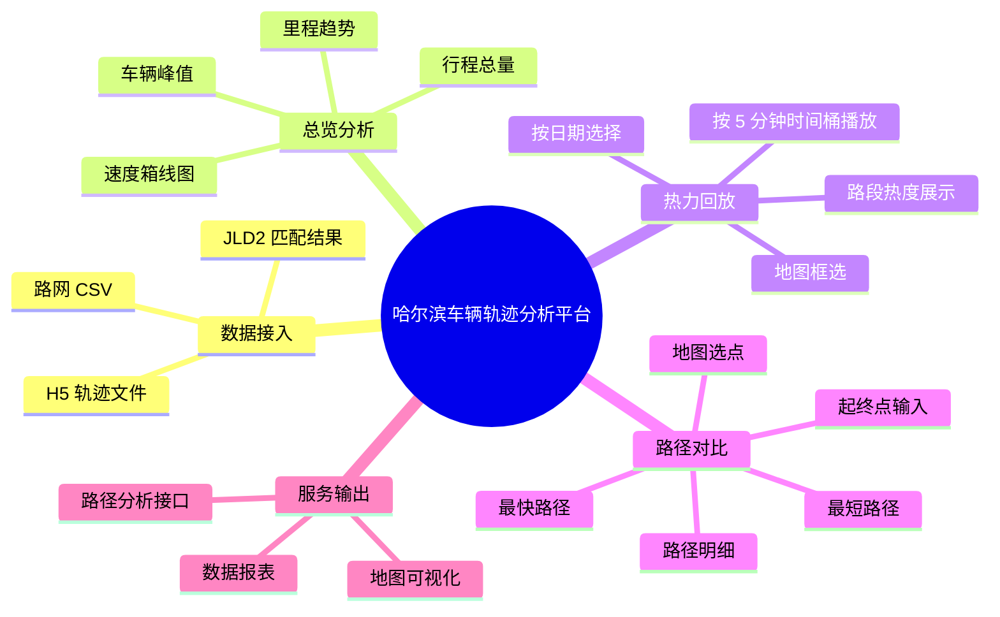
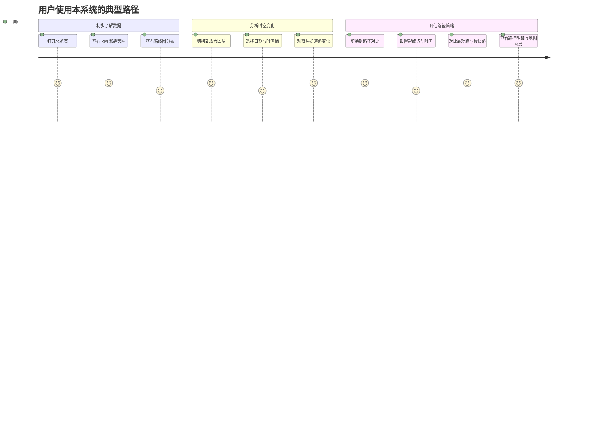

# 产品说明与业务场景

本文档从“项目做什么、给谁用、解决什么问题、如何体现课程作业价值”几个角度，对系统进行产品化描述。

## 1. 产品简介

本项目是一个面向哈尔滨车辆轨迹数据的分析平台，核心能力包括：

- 轨迹数据入仓
- 日级统计指标分析
- 道路热力图分时回放
- 最短路与最快路对比

从产品视角看，它更接近“交通数据分析与决策支持平台”，而不是纯数据库系统，也不是单纯的地图展示系统。

## 2. 产品功能总览

## 3. 主要用户与使用场景

### 3.1 主要用户

| 用户角色 | 关注点 | 典型动作 |
| --- | --- | --- |
| 数据分析人员 | 数据规模、日趋势、分布特征 | 查看总览和箱线图 |
| 交通场景研究人员 | 不同时段的道路流量变化 | 使用热力回放查看时间桶变化 |
| 路径评估人员 | 路线成本、速度差异、路径重合度 | 比较最短路和最快路 |
| 课程作业评审/教师 | 是否具备数据中台四大能力 | 查看系统分层、页面、接口和价值输出 |
| 项目接手开发者 | 系统结构、接口能力、运行方式 | 阅读文档、启动项目、验证接口 |

### 3.2 业务场景

#### 场景一：城市交通态势分析

- 通过每日行程数、车辆数、总里程看整体交通活跃度。
- 通过速度和里程箱线图观察数据分布和异常值。
- 适用于教学演示、交通样本研究和离线分析。

#### 场景二：时段热力回放

- 按日期和 5 分钟时间桶回放道路流量变化。
- 适合查看早晚高峰、局部区域拥堵、路网活跃区变化。
- 适合做“时空分布”类分析展示。

#### 场景三：路径策略对比

- 给定起点、终点和查询时间，比较最短路径与最快路径。
- 当 `road_speed_bins` 已准备好时，最快路径会按时间桶速度权重计算。
- 适用于路径评估、出行策略分析和课程作业展示。

## 4. 页面与功能模块说明

### 4.1 总览页面

目标：用最少的页面交互，让用户快速知道“这批数据大概是什么样”。

主要功能：

- KPI 展示：总行程数、单日峰值车辆数、总里程。
- 趋势图：每日行程数、每日车辆数、每日里程。
- 分布图：里程箱线图、速度箱线图。

主要价值：

- 快速建立对样本规模和整体特征的感知。
- 便于课程展示“数据资产门户”和“数据报表”能力。

### 4.2 热力回放页面

目标：把离线聚合后的路段流量变化直观展示出来。

主要功能：

- 选择日期。
- 选择或播放时间桶。
- 通过地图展示当前时间桶的道路热度。
- 支持恢复/清空热力图图层。
- 支持设定框选范围查看局部区域。

主要价值：

- 展示“服务可视化”能力。
- 让道路流量由抽象表格转化为直观地图结果。

### 4.3 路径对比页面

目标：在同一个页面中同时呈现路径搜索能力和统计能力。

主要功能：

- 输入起始时间和查询时间。
- 输入或通过地图点击设置起终点。
- 执行路径对比，展示最短路和最快路。
- 地图上分别显示两条路径。
- 展示路径边列表、分段距离、耗时、累计值。
- 显示路径能力状态、边数、速度桶数量。

主要价值：

- 展示 `pgRouting` 能力。
- 展示“最快路不是固定结果，而受查询时间影响”的业务特征。

## 5. 业务价值说明

### 5.1 对课程作业的价值

项目较完整地覆盖了数据中台作业的核心能力：

- 汇聚整合：原始轨迹和匹配结果统一接入。
- 提纯加工：完成清洗、分层和聚合。
- 服务可视化：提供图表、热力图和地图交互。
- 价值变现：以交通分析、路径评估和辅助决策的形式体现价值。

### 5.2 对业务分析的价值

| 价值点 | 说明 |
| --- | --- |
| 数据资产沉淀 | 原始文件被转化为结构化明细表和统计表 |
| 决策辅助 | 可观察道路热度和路径策略差异 |
| 查询效率提升 | 把复杂计算前置到离线阶段，提升在线响应效率 |
| 展示友好 | 从数据库结果转换为前端图表和地图，便于理解 |

## 6. 典型使用路径

## 7. 与课程作业要求的对应说明

### 7.1 查询服务

- 当前系统通过 FastAPI 提供查询接口。
- 前端页面可视为一个数据资产门户入口。

### 7.2 数据报表

- 总览页中的 KPI、柱状图、折线图、箱线图属于典型报表能力。

### 7.3 数据大屏

- 当前页面是“轻量分析门户”，不是重运营大屏。
- 但热力图页面和 KPI 区已经具备大屏化展示的基础能力。

### 7.4 数据分析服务

- 已实现，表现为日统计、热力图、路径对比三类分析能力。

### 7.5 推荐服务与圈人服务

- 当前项目没有实现传统电商/营销意义上的推荐或圈人服务。
- 从课程作业解释角度，可以把“最快路径推荐”视为一种面向出行场景的策略推荐能力。

这里需要明确说明：这是一种面向交通分析的“推荐式结果输出”，而不是用户画像驱动的推荐系统。

## 8. 当前产品形态的边界

- 不支持实时流式轨迹接入。
- 不具备多用户权限与运营后台。
- 不提供商业级告警或调度闭环。
- 路径搜索建立在离线生成的路网与速度桶之上，不是实时导航系统。

## 9. 小结

从产品层面看，这个项目最适合被描述为：

“一个以车辆轨迹为核心数据资产、以热力回放和路径对比为亮点能力、面向交通分析与课程展示的数据分析平台。”

它的价值并不在于做成一个通用 SaaS，而在于把原始轨迹数据转化为可理解、可分析、可展示的业务结果。
