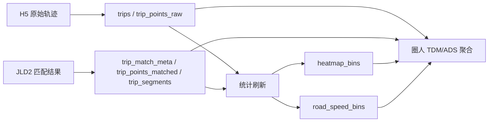
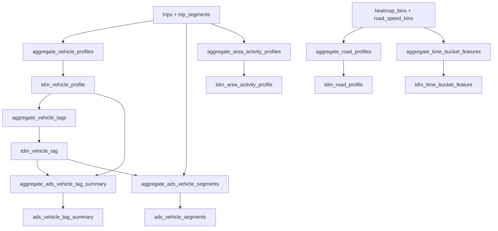
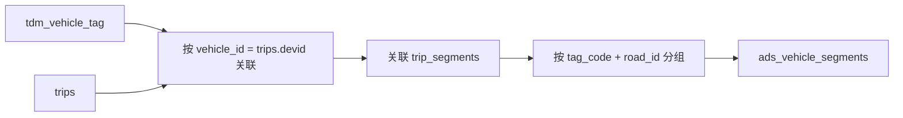
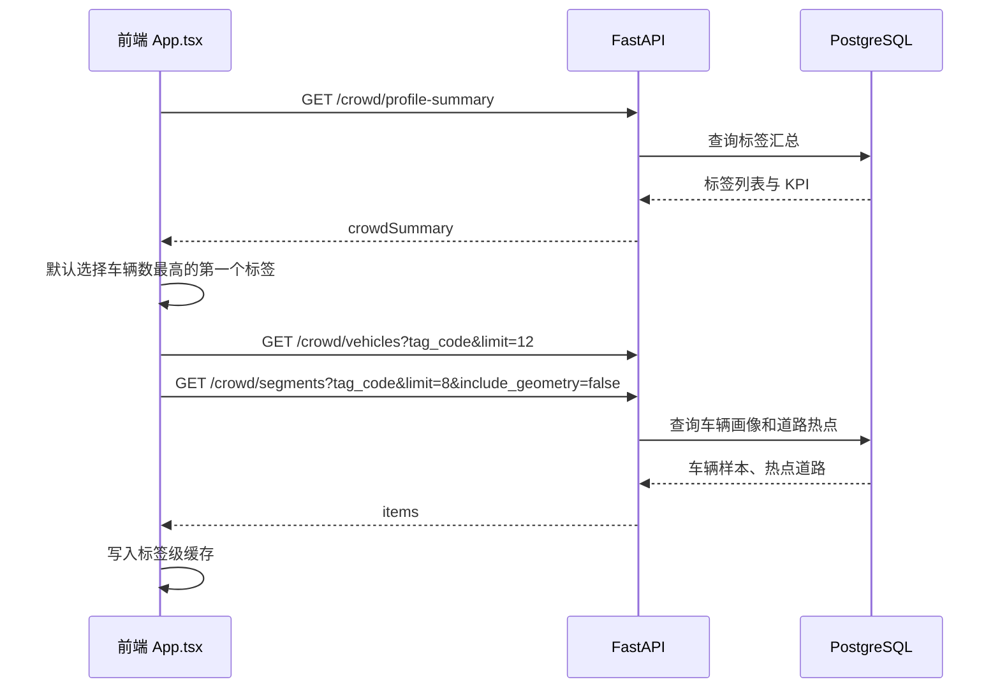
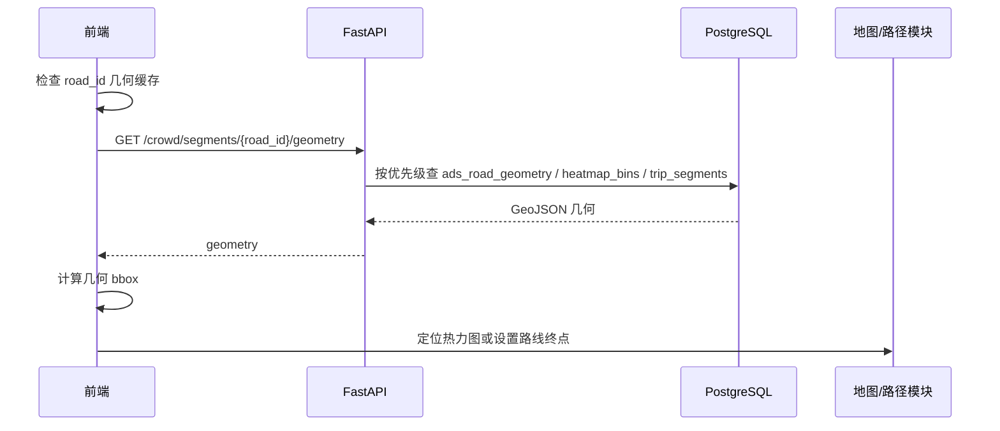
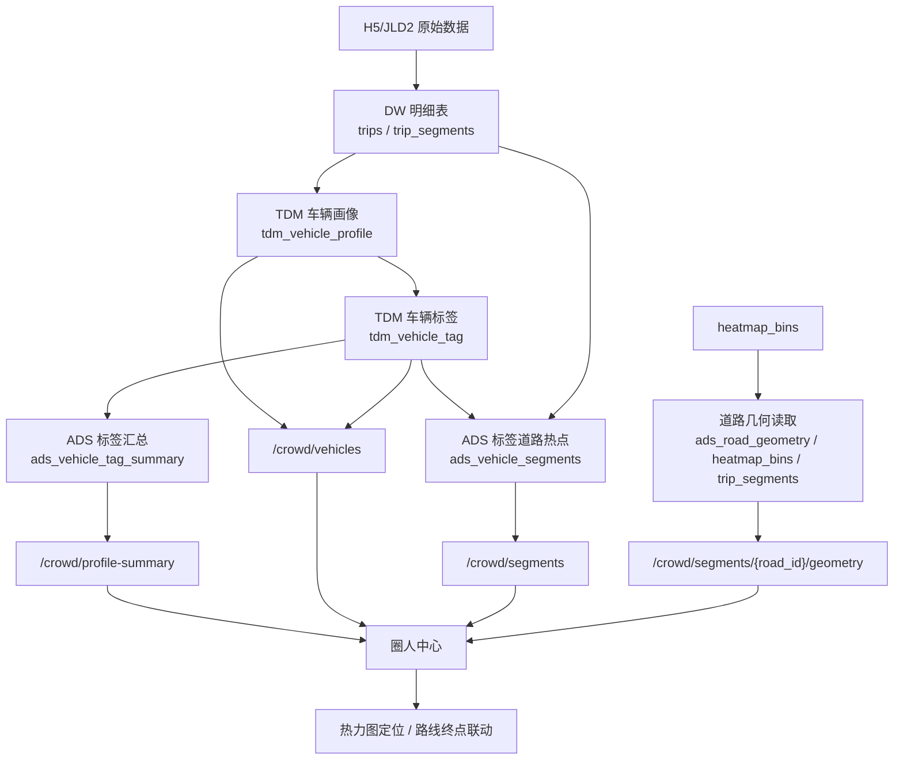

# 圈人中心实现说明

本文档说明圈人中心的业务功能、数据处理逻辑、数据流向、接口设计和前端交互。对应实现主要位于：

- 后端聚合：`backend/app/services/tdm_service.py`
- 后端查询：`backend/app/services/crowd_service.py`
- API 路由：`backend/app/api/routes.py`
- 前端调用：`frontend/src/api.ts`
- 前端页面：`frontend/src/App.tsx`

## 1. 功能定位

圈人中心用于把车辆轨迹明细转化为可筛选、可解释的人群标签和道路热点结果。它不是实时在线打标签，而是在离线入仓和统计刷新阶段生成 TDM/ADS 读模型，前端按标签快速查询车辆样本和道路热点。

当前已实现的能力包括：

| 功能 | 说明 |
| --- | --- |
| 标签总览 | 展示车辆画像数、已打标签车辆数、标签种类数 |
| 标签筛选 | 按车辆标签切换，如高峰通勤车、夜间活跃车、短途高频车、长途跨区车、常规活跃车 |
| 车辆样本 | 展示某个标签下的代表车辆、行程次数、活跃天数、总里程 |
| 道路热点 | 展示某个标签车辆高频经过的道路，包含经过次数、车辆数、距离、平均速度 |
| 热力联动 | 点击道路热点后，按道路几何定位到热力图范围 |
| 路线联动 | 点击道路热点后，将该道路中心点设置为路线终点，跳转到路径模块 |

## 2. 数据输入

圈人中心依赖的是已经完成入仓和统计聚合后的数据库表，不直接读取原始文件。

| 上游数据 | 来源 | 作用 |
| --- | --- | --- |
| `trips` | H5 原始轨迹入仓 | 提供车辆 ID、行程日期、起止时间、有效性 |
| `trip_segments` | JLD2 匹配结果和分段入仓 | 提供路段、距离、速度、起终点坐标、路径几何 |
| `heatmap_bins` | 统计刷新生成 | 提供道路热力、路段几何兜底来源 |
| `road_speed_bins` | 统计刷新生成 | 提供道路速度特征，用于道路画像 |

原始数据进入圈人中心前，会先经过如下基础链路：



## 3. 离线数据处理流程

圈人中心的核心数据在 `tdm_service.aggregate_tdm_and_ads_models()` 中生成。该函数在统计刷新阶段被调用，位置在 `backend/app/etl/load_data.py` 的 compute 步骤中：

```text
daily_metrics
daily_distance_boxplot
daily_speed_boxplot
heatmap_bins
road_speed_bins
tdm_service.aggregate_tdm_and_ads_models()
table_row_stats
```

完整处理流程如下：



### 3.1 车辆画像生成

`aggregate_vehicle_profiles()` 从 `trips` 和 `trip_segments` 聚合到 `tdm_vehicle_profile`。

主要处理逻辑：

1. 先按 `trip_id` 汇总每次行程距离和行程平均速度。
2. 再回连 `trips`，得到每辆车的行程日期、出发时间、距离、速度。
3. 按车辆维度聚合活跃天数、行程次数、总里程、平均单次里程、平均速度。
4. 根据出发小时统计车辆出行习惯：
   - 早间出行：`6-9` 点
   - 高峰出行：`7-9` 点或 `17-20` 点
   - 夜间出行：`21` 点后或 `6` 点前
   - 短途行程：单次距离 `< 5000m`
   - 长途行程：单次距离 `>= 8000m`
5. 计算每辆车出现频率最高的 `dominant_start_hour`。

输出表 `tdm_vehicle_profile` 的关键字段：

| 字段 | 含义 |
| --- | --- |
| `vehicle_id` | 车辆 ID，来自 `trips.devid` |
| `active_days` | 活跃天数 |
| `trip_count` | 有效行程数 |
| `total_distance_m` | 累计里程 |
| `avg_trip_distance_m` | 平均单次行程距离 |
| `avg_speed_kmh` | 平均速度 |
| `morning_trip_count` | 早间出行次数 |
| `night_trip_count` | 夜间出行次数 |
| `peak_trip_count` | 高峰出行次数 |
| `short_trip_count` | 短途行程次数 |
| `long_trip_count` | 长途行程次数 |
| `dominant_start_hour` | 最常见出发小时 |

### 3.2 车辆标签生成

`aggregate_vehicle_tags()` 从 `tdm_vehicle_profile` 生成 `tdm_vehicle_tag`。当前标签是规则型统计标签，每个标签带有 `tag_score` 和 `evidence` 证据 JSON。

| 标签编码 | 标签名称 | 判定规则 |
| --- | --- | --- |
| `commuter` | 高峰通勤车 | 高峰行程数 `>= max(1, ceil(trip_count * 0.5))` |
| `night_active` | 夜间活跃车 | 夜间行程数 `>= max(1, ceil(trip_count * 0.33))` |
| `short_high_freq` | 短途高频车 | 行程数 `>= 3` 且平均单次距离 `< 5000m` |
| `long_distance` | 长途跨区车 | 平均单次距离 `>= 8000m` 或总里程 `>= 20000m` |
| `steady_vehicle` | 常规活跃车 | 未命中上述任一标签的兜底标签 |

标签证据示例：

```json
{
  "peak_trip_count": 5,
  "trip_count": 8,
  "dominant_start_hour": 8
}
```

### 3.3 标签汇总读模型

`aggregate_ads_vehicle_tag_summary()` 从 `tdm_vehicle_tag` 和 `tdm_vehicle_profile` 生成 `ads_vehicle_tag_summary`，用于圈人中心顶部标签条和 KPI。

聚合口径：

- `vehicle_count`：标签下车辆数。
- `avg_trip_count`：标签车辆平均行程数。
- `avg_trip_distance_m`：标签车辆平均单次行程距离。
- `avg_speed_kmh`：标签车辆平均速度。

### 3.4 标签道路热点读模型

`aggregate_ads_vehicle_segments()` 从标签车辆回连其行程和路段，生成 `ads_vehicle_segments`。

处理逻辑：



聚合口径：

| 字段 | 说明 |
| --- | --- |
| `tag_code` / `tag_name` | 标签编码和标签名 |
| `road_id` / `road_name` | 热点道路 |
| `trip_count` | 标签车辆经过该道路的分段次数 |
| `vehicle_count` | 经过该道路的标签车辆数 |
| `distance_m` | 标签车辆在该道路上的累计距离 |
| `avg_speed_kmh` | 标签车辆经过该道路的平均速度 |

表上创建了排序索引：

```sql
CREATE INDEX IF NOT EXISTS idx_ads_vehicle_segments_tag_rank
ON ads_vehicle_segments(tag_code, trip_count DESC, distance_m DESC, road_id);
```

该索引用于支撑前端按标签获取 Top 道路热点。

## 4. 在线查询接口

圈人中心 API 都挂载在 `/api/v1/crowd` 下。

| 接口 | 方法 | 用途 | 主要读取表 |
| --- | --- | --- | --- |
| `/crowd/profile-summary` | GET | 获取标签总览和标签列表 | `tdm_vehicle_profile`、`tdm_vehicle_tag`、`ads_vehicle_tag_summary` |
| `/crowd/vehicles` | GET | 获取标签下车辆样本 | `tdm_vehicle_profile`、`tdm_vehicle_tag` |
| `/crowd/segments` | GET | 获取标签下道路热点 | `ads_vehicle_segments` |
| `/crowd/segments/{road_id}/geometry` | GET | 按需获取某条道路几何 | `ads_road_geometry`、`heatmap_bins`、`trip_segments` |

### 4.1 标签总览

`fetch_crowd_profile_summary()` 会先检查相关表是否存在。如果 TDM/ADS 表未生成，接口返回空结果而不是报错，保证页面可打开。

返回内容包括：

- `total_vehicle_count`：`tdm_vehicle_profile` 总车辆画像数。
- `tagged_vehicle_count`：`tdm_vehicle_tag` 中去重车辆数。
- `tag_count`：标签种类数。
- `items`：每个标签的车辆数和平均画像指标。

### 4.2 车辆样本

`fetch_crowd_vehicles(tag_code, limit)` 支持传入 `tag_code`。

查询逻辑：

1. 先从 `tdm_vehicle_tag` 按车辆聚合标签名称数组。
2. 从 `tdm_vehicle_profile` 读取车辆画像字段。
3. 如果传入 `tag_code`，使用 `EXISTS` 过滤命中该标签的车辆。
4. 按 `trip_count DESC, total_distance_m DESC, vehicle_id` 排序。
5. 返回限定数量，前端当前固定 `limit=12`。

### 4.3 道路热点

`fetch_crowd_segments(tag_code, limit, include_geometry)` 支持两个查询模式：

| 模式 | 说明 |
| --- | --- |
| `include_geometry=false` | 默认模式，只返回道路统计字段，不返回几何，响应更快 |
| `include_geometry=true` | 同步从 `trip_segments.path_geom` 聚合道路几何，数据量大，不建议首屏使用 |

前端当前调用：

```text
GET /api/v1/crowd/segments?tag_code=xxx&limit=8&include_geometry=false
```

这样道路热点首屏只读取 `ads_vehicle_segments`，避免每次切标签时实时扫描大表 `trip_segments`。

### 4.4 道路几何按需加载

`fetch_crowd_segment_geometry(road_id)` 是道路热点的按需补充接口。它按优先级寻找几何：

1. 优先读 `ads_road_geometry`：
   - 先取 `simplified_geojson`
   - 再取 `geometry_geojson`
   - 最后从 `geometry` 转 GeoJSON
2. 如果没有 `ads_road_geometry`，尝试从 `heatmap_bins` 取该路段流量最高的一条几何，并做简化。
3. 如果仍没有，再从 `trip_segments.path_geom` 聚合该道路全部分段几何。

该设计把“列表统计”和“地图定位几何”拆开，降低圈人中心首屏加载压力。

## 5. 前端数据流

前端页面在 `App.tsx` 中实现，核心状态包括：

| 状态 | 作用 |
| --- | --- |
| `crowdSummary` | 标签总览和标签列表 |
| `selectedCrowdTag` | 当前选中的标签 |
| `crowdVehicles` | 当前标签下车辆样本 |
| `crowdSegments` | 当前标签下道路热点 |
| `crowdVehiclesLoading` | 车辆样本局部加载状态 |
| `crowdSegmentsLoading` | 道路热点局部加载状态 |
| `crowdGeometryLoadingRoadId` | 当前正在加载几何的道路 ID |
| `crowdVehiclesCacheRef` | 按标签缓存车辆样本 |
| `crowdSegmentsCacheRef` | 按标签缓存道路热点 |
| `crowdSegmentGeometryCacheRef` | 按道路缓存几何 |

页面加载和切换标签流程：



用户点击道路热点后的流程：



## 6. 端到端数据流向



## 7. 数据缺失与降级策略

圈人中心对数据就绪状态做了软降级：

- 如果 `tdm_vehicle_profile`、`tdm_vehicle_tag`、`ads_vehicle_tag_summary` 不存在，标签总览返回 0 和空列表。
- 如果 `tdm_vehicle_profile` 或 `tdm_vehicle_tag` 不存在，车辆样本返回空数组。
- 如果 `ads_vehicle_segments` 不存在，道路热点返回空数组。
- 道路几何优先读轻量 ADS 表，缺失时逐级回退到热力表和明细表。

这种策略保证即使离线聚合未完成，前端也不会因为接口异常而无法进入页面。

## 8. 性能设计

圈人中心当前的性能优化重点在“首屏统计轻量化、几何按需加载”。

已实现设计：

- 道路热点默认 `include_geometry=false`，避免首屏拉取大 GeoJSON。
- 车辆样本和道路热点分别维护 loading 状态，避免一个慢接口阻塞整个圈人中心。
- 前端按 `tag_code` 缓存车辆样本和道路热点。
- 前端按 `road_id` 缓存道路几何。
- 切换标签时使用 `AbortController` 取消过期请求。
- `ads_vehicle_segments` 建立按标签和排名的索引。

仍可继续优化的方向：

- 固化 `ads_road_geometry` 的构建流程，减少几何接口回退扫描 `trip_segments` 的概率。
- 增加标签解释弹窗，展示 `tdm_vehicle_tag.evidence`。
- 将车辆样本分页化，支持更多样本浏览。
- 增加标签组合筛选，例如“高峰通勤车 + 长途跨区车”。

## 9. 与数据中台分层的对应关系

| 分层 | 圈人中心中的对象 |
| --- | --- |
| ODS | 原始 H5/JLD2 文件 |
| DW | `trips`、`trip_segments` |
| TDM | `tdm_vehicle_profile`、`tdm_vehicle_tag`、`tdm_road_profile`、`tdm_area_activity_profile`、`tdm_time_bucket_feature` |
| ADS | `ads_vehicle_tag_summary`、`ads_vehicle_segments`、圈人中心 API |

圈人中心的关键价值在于把明细轨迹转换为“车辆画像、标签、人群道路偏好”这些可复用的数据资产，再通过标准接口给前端应用消费。
