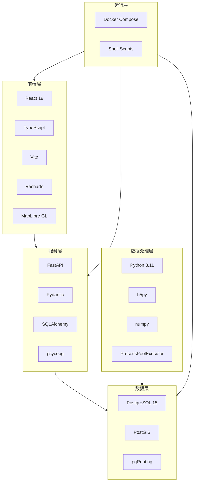
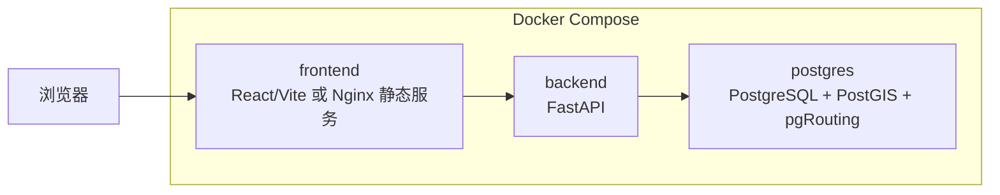
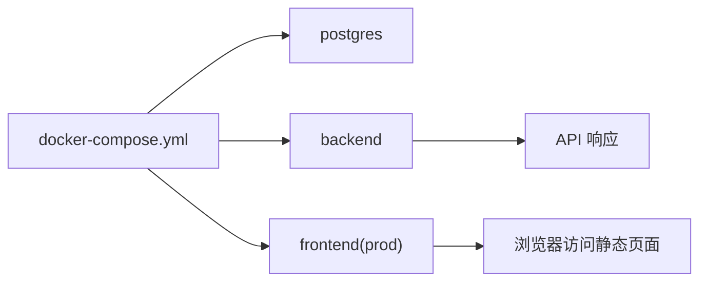
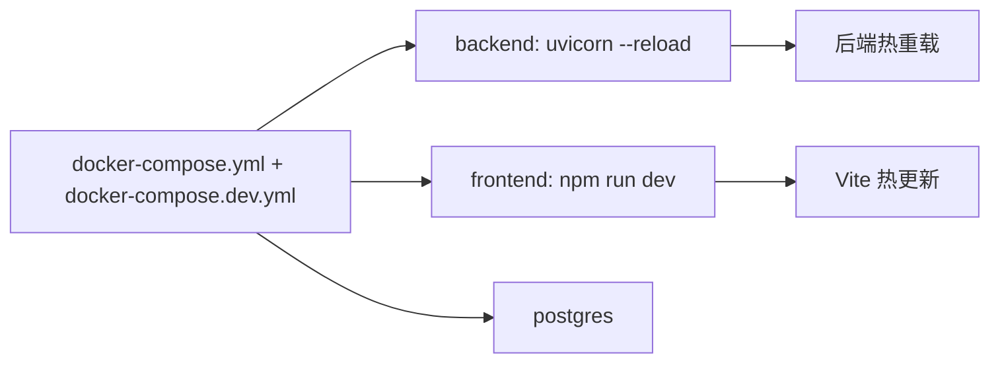

# 技术栈与部署架构

本文档聚焦工程实现层面，说明本项目采用了哪些技术栈、各技术位于系统的哪一层、服务如何部署，以及开发态和运行态的差异。

## 1. 技术栈总览

## 2. 分层技术说明

| 层级 | 使用技术 | 作用 |
| --- | --- | --- |
| 前端展示层 | React、TypeScript、Vite、Recharts、MapLibre GL | 构建 SPA 页面、图表和地图交互 |
| API 服务层 | FastAPI、Pydantic、SQLAlchemy、psycopg | 提供 HTTP 接口、请求校验、数据库访问 |
| 离线处理层 | Python、h5py、numpy、并行执行器 | 解析原始文件、并发入仓、离线聚合 |
| 数据层 | PostgreSQL、PostGIS、pgRouting | 结构化存储、空间计算、图搜索 |
| 部署与运维层 | Docker Compose、Shell 脚本 | 本地一键启动、开发模式和服务编排 |

## 3. 容器部署架构图

### 3.1 服务说明

| 服务 | Compose 配置 | 主要职责 | 暴露端口 |
| --- | --- | --- | --- |
| `postgres` | `docker-compose.yml` | 存储明细、统计、路网和路径结果 | `5432` |
| `backend` | `docker-compose.yml` | 提供分析 API 和路径搜索 API | `8000` |
| `frontend` | `docker-compose.yml` / `docker-compose.dev.yml` | 提供前端页面 | 生产态 `5173->80`，开发态 `5173->5173` |

## 4. 开发态与运行态区别

### 4.1 生产/演示态

默认 `docker-compose.yml` 走的是“相对稳定的展示态”：

- `postgres` 使用带 PostGIS/pgRouting 的数据库镜像。
- `backend` 运行 FastAPI 服务。
- `frontend` 使用 `Dockerfile.prod`，对外提供静态站点。

### 4.2 开发态

叠加 `docker-compose.dev.yml` 后：

- 后端改为 `uvicorn --reload`
- 前端改为 `vite dev server`
- 挂载源码目录，便于热更新

## 5. 关键技术选型说明

### 5.1 为什么选 PostgreSQL + PostGIS + pgRouting

- `PostgreSQL` 负责结构化关系存储。
- `PostGIS` 提供几何类型、空间索引、距离与相交计算。
- `pgRouting` 直接在数据库侧执行最短路径与最快路径搜索。

这套组合让项目能够把“空间分析”和“路径分析”尽量放在数据库层完成，减少 Python 层手写图搜索逻辑的复杂度。

### 5.2 为什么选 FastAPI

- 天然适合快速提供结构化 JSON API。
- 与 `Pydantic` 结合后，接口契约清晰。
- 自动生成 OpenAPI 文档，适合前后端联调和课程展示。

### 5.3 为什么选 React + Recharts + MapLibre GL

- `React` 负责组织单页应用。
- `Recharts` 适合中小规模统计图表展示。
- `MapLibre GL` 能在前端高效渲染路段线层和路径图层，适合热力回放和路径对比。

### 5.4 为什么离线处理使用 Python + h5py

- 原始轨迹数据是 `H5`，`h5py` 对它的解析支持直接而稳定。
- `numpy` 适合处理大批量数值数组。
- 结合 `psycopg COPY` 可以较高效地落库。

## 6. 关键依赖清单

### 6.1 后端依赖

来自 `backend/pyproject.toml`：

| 依赖 | 用途 |
| --- | --- |
| `fastapi` | 提供 API 框架 |
| `uvicorn` | 运行 ASGI 服务 |
| `sqlalchemy` | ORM 和数据库访问 |
| `psycopg[binary]` | PostgreSQL 驱动 |
| `pydantic`、`pydantic-settings` | 配置与响应模型 |
| `h5py` | 读取 H5 文件 |
| `numpy` | 数组处理 |
| `networkx` | 当前代码中不是主路径核心，但作为图处理依赖保留 |

### 6.2 前端依赖

来自 `frontend/package.json`：

| 依赖 | 用途 |
| --- | --- |
| `react`、`react-dom` | 前端 UI 基础框架 |
| `maplibre-gl` | 地图渲染 |
| `recharts` | 图表渲染 |
| `vite` | 构建与开发服务器 |
| `typescript` | 类型系统 |
| `vitest` | 前端测试 |

## 7. 数据库对象与空间能力

### 7.1 数据库初始化

数据库镜像基于：

- `postgis/postgis:15-3.3`
- 安装 `postgresql-15-pgrouting`

初始化脚本负责创建：

- `postgis`
- `pg_trgm`
- `pgrouting`
- 路网表、统计表、路径结果表、索引

### 7.2 数据库承担的三类职责

| 职责 | 说明 |
| --- | --- |
| 业务存储 | 保存轨迹明细、统计表和路径结果 |
| 空间计算 | 距离计算、几何相交、空间最近邻 |
| 图搜索 | 调用 `pgr_dijkstra` 做路径搜索 |

## 8. 非功能性特征

### 8.1 性能优化思路

- 明细写入采用分块 `COPY`。
- 入仓阶段会临时删除热点索引，降低写入成本。
- 支持多进程并行入仓。
- 统计采用离线预计算，避免在线大表扫描。

### 8.2 可维护性

- API、查询、路径、统计、入仓逻辑拆分到不同 service。
- `docker-compose.yml` 与 `docker-compose.dev.yml` 分别面向运行态和开发态。
- 文档和脚本较完整，便于接手。

### 8.3 可扩展性

- 可继续增加新的统计表和图表接口。
- 可替换前端页面为更大屏的展示形态。
- 可在路径服务中引入更多动态权重或路线策略。

## 9. 技术架构与课程作业要求的关系

从作业角度看，这套技术栈支撑了以下目标：

- Docker 和脚本保证系统能被快速搭建和复现。
- FastAPI + React 保证服务化与可视化能力。
- PostgreSQL + PostGIS + pgRouting 保证数据分析和路径能力。
- Python ETL 保证原始数据可以被清洗、整合和加工。

也就是说，技术栈并不是单纯“为了把程序跑起来”，而是直接服务于“数据中台四大能力”的落地。

## 10. 小结

本项目的技术栈选择有一个很鲜明的特点：

它不是追求组件数量多，而是强调“用一套足够稳定的技术，把离线计算、空间分析、图搜索和前端可视化贯通起来”。

这也是为什么本项目的工程形态非常适合课程作业、原型验证和中小规模分析平台演示。
