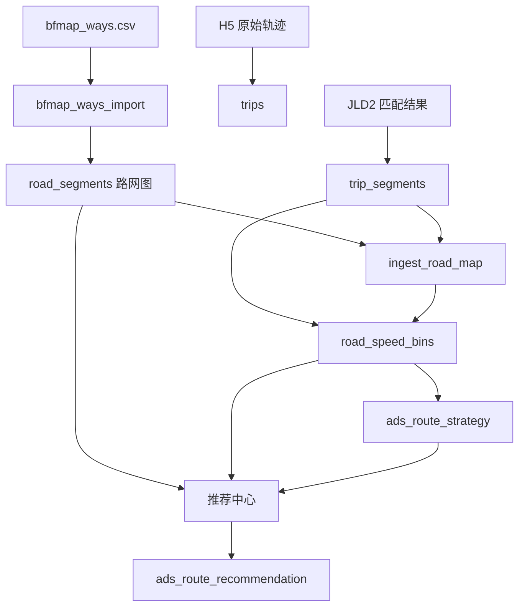
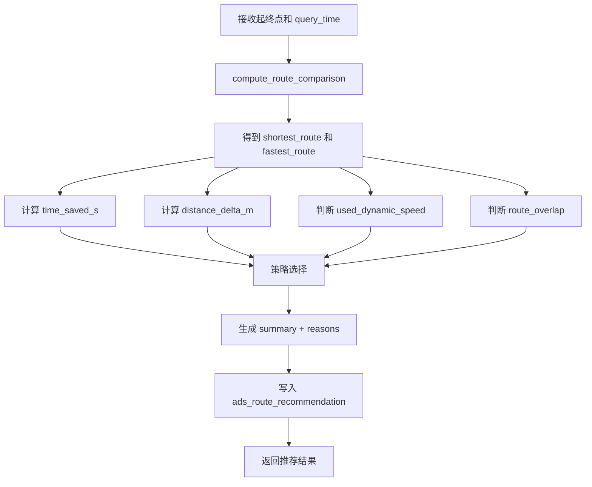
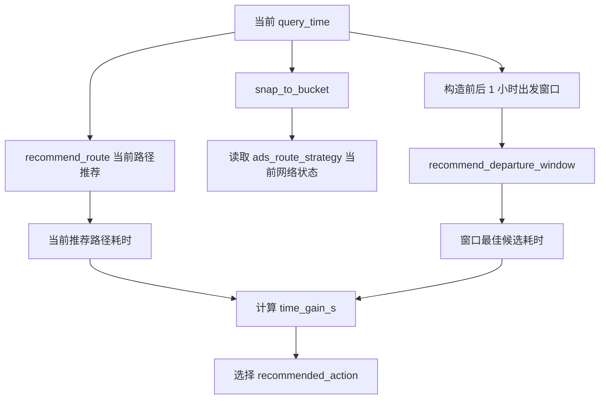
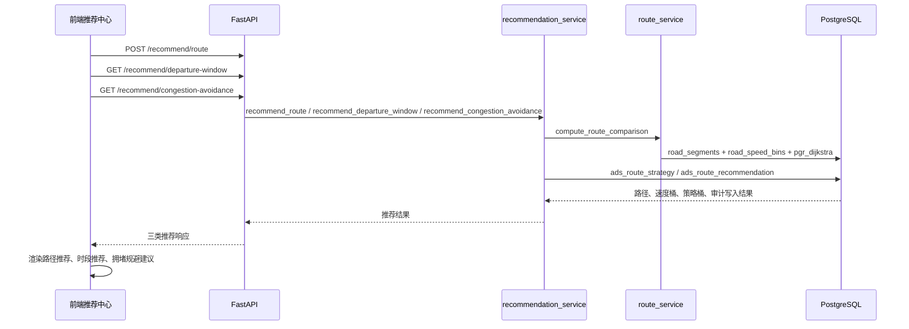
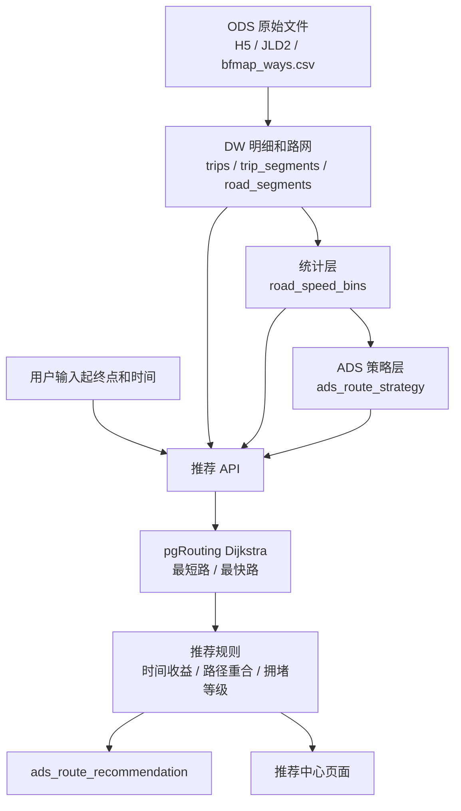

# 推荐中心实现说明

本文档说明推荐中心的业务功能、数据处理逻辑、数据流向、接口设计和前端交互。对应实现主要位于：

- 推荐服务：`backend/app/services/recommendation_service.py`
- 路径计算：`backend/app/services/route_service.py`
- 图搜索：`backend/app/services/route_search_service.py`
- 路径载荷：`backend/app/services/route_payload_service.py`
- 路由 API：`backend/app/api/routes.py`
- 前端调用：`frontend/src/api.ts`
- 前端页面：`frontend/src/App.tsx`

## 1. 功能定位

推荐中心面向交通出行场景，基于路网图、历史速度桶和路径搜索结果，输出可解释的出行建议。它不是实时导航系统，而是基于项目内已入仓历史轨迹和统计读模型的策略推荐服务。

当前推荐中心提供三类建议：

| 推荐类型 | 接口 | 作用 |
| --- | --- | --- |
| 路径推荐 | `POST /api/v1/recommend/route` | 对同一起终点输出最短路和最快路，并推荐更合适的策略 |
| 出发时段推荐 | `GET /api/v1/recommend/departure-window` | 在指定日期和小时窗口内寻找预计耗时更低的出发时间 |
| 拥堵规避建议 | `GET /api/v1/recommend/congestion-avoidance` | 结合当前时段网络状态、路径推荐和出发窗口推荐，输出行动建议 |

前端在“推荐中心”中一次点击会并行调用三类推荐接口，并把结果展示为三个建议卡片。

## 2. 数据输入

推荐中心依赖两个层面的数据：

1. 路网图数据：用于计算可通行路径。
2. 速度和策略数据：用于估计时间、判断拥堵、选择推荐方案。

| 数据对象 | 来源 | 用途 |
| --- | --- | --- |
| `road_segments` | `bfmap_ways.csv` 构建 | pgRouting 主图，提供边、节点、长度、静态通行时间 |
| `road_speed_bins` | `trip_segments + ingest_road_map` 聚合 | 每 5 分钟、每路段速度统计，作为最快路动态权重 |
| `ads_route_strategy` | `road_speed_bins` 聚合 | 每个时间桶的整体路网状态，服务出发时段和拥堵规避 |
| `ads_route_recommendation` | 推荐服务在线写入 | 保存推荐结果和审计信息 |
| `route_results` | 路径对比接口在线写入 | 保存普通路径对比结果，推荐接口内部默认不写该表 |

推荐中心的基础数据链路：



## 3. 离线数据处理流程

推荐中心的离线数据准备分为路网构建、速度桶聚合、策略读模型聚合三步。

### 3.1 路网构建

路网构建发生在 ETL 的 route network 阶段：

```text
bfmap_ways.csv
-> bfmap_ways_import
-> road_segments
-> ingest_road_map
```

处理逻辑：

1. `road_network_service.import_bfmap_csv()` 导入 BfMap 边表。
2. `road_network_service.rebuild_road_segments_from_bfmap()` 生成 `road_segments`。
3. `road_mapping_service.rebuild_ingest_road_map()` 将入仓轨迹中的道路 ID 映射到 BfMap 路网边。

`road_segments` 是 pgRouting 主图，关键字段包括：

| 字段 | 说明 |
| --- | --- |
| `id` | pgRouting 使用的边 ID |
| `road_id` | 业务道路 ID |
| `source_node` | 起点节点 |
| `target_node` | 终点节点 |
| `length_m` | 边长度 |
| `travel_time_s` | 静态通行时间 |
| `geom` | 道路几何 |

### 3.2 速度桶聚合

`stats_service.aggregate_road_speed_bins()` 从 `trip_segments` 和 `ingest_road_map` 生成 `road_speed_bins`。

速度桶的核心思想：

- 按 5 分钟时间桶聚合。
- 按道路聚合速度统计。
- 推荐服务在查询时把 `query_time` 对齐到 5 分钟桶，命中该桶速度后计算最快路。

推荐中心不直接扫描轨迹明细来算最快路，而是读取已经沉淀好的 `road_speed_bins`。

### 3.3 路网策略读模型

`tdm_service.aggregate_ads_route_strategy()` 从 `road_speed_bins` 生成 `ads_route_strategy`。

聚合口径：

1. 按 `bucket_start` 聚合每个时间桶。
2. 统计该桶内有速度数据的道路数 `road_count`。
3. 统计拥堵道路数 `congested_road_count`，当前规则为速度 `< 20 km/h`。
4. 计算平均速度 `avg_speed_kmh`。
5. 计算拥堵比例 `congestion_ratio = congested_road_count / road_count`。
6. 给出 `recommendation_level`：
   - `smooth`：平均速度 `>= 35 km/h` 且拥堵比例 `<= 0.15`
   - `balanced`：平均速度 `>= 25 km/h` 且拥堵比例 `<= 0.35`
   - `congested`：不满足以上条件

该表主要服务出发时段推荐和拥堵规避建议。

## 4. 在线路径计算逻辑

推荐中心底层复用路径对比能力，核心函数是 `compute_route_comparison()`。

### 4.1 请求标准化

输入参数来自前端：

| 参数 | 说明 |
| --- | --- |
| `start_time` | 出发时间 |
| `query_time` | 用于命中速度桶的查询时间 |
| `start_point.lat/lon` | 起点经纬度 |
| `end_point.lat/lon` | 终点经纬度 |

后端会先做两项标准化：

1. `to_naive_datetime()`：去掉时区信息，统一使用无时区时间。
2. `snap_to_bucket()`：把 `query_time` 向下对齐到 5 分钟桶。例如 `08:07:30` 会对齐到 `08:05:00`。

### 4.2 起终点吸附

`nearest_graph_node_with_snap()` 会把输入经纬度吸附到 `road_segments` 最近的图节点。

查询方式：

1. 从 `road_segments` 取所有 `source_node` 的起点几何。
2. 取所有 `target_node` 的终点几何。
3. 用 PostGIS 距离计算找到离输入点最近的节点。
4. 返回节点 ID、吸附后的经纬度、吸附距离。

推荐结果会返回：

- `nearest_start_node`
- `nearest_end_node`
- `snapped_start_point`
- `snapped_end_point`

### 4.3 最短路

最短路调用 `run_pgr_dijkstra(weight="distance_m")`。

边权重：

```sql
COALESCE(length_m, ST_Length(geom::geography))
```

也就是说，最短路只看距离，不使用速度桶。

### 4.4 最快路

最快路调用 `run_pgr_dijkstra(weight="travel_time_s", bucket_start=...)`。

如果 `road_speed_bins` 中存在当前时间桶数据，最快路使用动态速度权重：

```sql
length_m / (median_speed_kmh / 3.6)
```

如果某条边没有速度，或速度不可用，则回退：

1. 优先使用 `road_segments.travel_time_s`
2. 再回退到 `length_m / 8.33`

这里 `8.33 m/s` 约等于 `30 km/h`，作为静态兜底速度。

如果当前时间桶完全没有 `road_speed_bins` 数据，系统不会再跑动态最快路，而是把最短路作为最快路候选，并标记：

```text
used_dynamic_speed = false
fallback_mode = static_weights
```

### 4.5 路径载荷构造

`build_route_payload()` 会把 pgRouting 返回的边序列转换为前端可展示的结构：

- 路线总距离 `distance_m`
- 预计耗时 `estimated_time_s`
- 每条边的距离、耗时、累计距离、累计耗时
- 每条边的 WKT 几何 `path_wkt`
- 路径几何数组 `path_wkt_segments`

推荐中心后续判断时间收益、路径重合、里程差，都基于该结构。

## 5. 路径推荐逻辑

路径推荐接口：

```text
POST /api/v1/recommend/route
```

核心函数：`recommend_route()`。

处理流程：



关键指标：

| 指标 | 计算方式 | 说明 |
| --- | --- | --- |
| `time_saved_s` | `shortest.estimated_time_s - fastest.estimated_time_s` | 最快路相对最短路节省的时间 |
| `distance_delta_m` | `fastest.distance_m - shortest.distance_m` | 选择最快路会多走或少走的距离 |
| `used_dynamic_speed` | 当前时间桶是否命中 `road_speed_bins` | 是否使用历史速度特征 |
| `route_overlap` | 两条路径 WKT 序列是否一致 | 最短路和最快路是否完全一致 |

推荐策略规则：

| 条件 | 推荐策略 | 文案 |
| --- | --- | --- |
| 命中动态速度、路径不重合、节省时间 `> 15s` | `fastest` | 推荐最快路径，预计可节省时间 |
| 最短路与最快路一致 | `shortest` | 路径一致，沿用主路径 |
| 未命中动态速度 | `shortest` | 回退到静态权重策略 |
| 最快路更远且节省时间 `<= 15s` | `shortest` | 时间差异小，推荐更短主路径 |
| 其他情况 | `fastest` | 时间收益优先 |

返回结果包括：

- 推荐策略 `recommended_strategy`
- 是否使用动态速度 `used_dynamic_speed`
- 回退模式 `fallback_mode`
- 推荐摘要 `summary`
- 推荐原因 `reasons`
- 推荐路径和备选路径
- 原始最短路和最快路

## 6. 出发时段推荐逻辑

出发时段推荐接口：

```text
GET /api/v1/recommend/departure-window
```

核心函数：`recommend_departure_window()`。

输入参数：

| 参数 | 说明 |
| --- | --- |
| `travel_date` | 出行日期 |
| `start_lat/start_lon` | 起点 |
| `end_lat/end_lon` | 终点 |
| `window_start_hour` | 候选开始小时，默认 7 |
| `window_end_hour` | 候选结束小时，默认 10 |
| `step_minutes` | 无策略数据时的兜底步长，默认 15 |

### 6.1 候选时间生成

`_candidate_departure_times()` 优先从 `ads_route_strategy` 中选择候选桶：

```sql
ORDER BY
  CASE recommendation_level
    WHEN 'smooth' THEN 1
    WHEN 'balanced' THEN 2
    ELSE 3
  END,
  avg_speed_kmh DESC,
  bucket_start
LIMIT 8
```

也就是说，候选时间优先选择更顺畅、平均速度更高的时间桶。

如果 `ads_route_strategy` 不存在或无符合条件的数据，则按 `window_start_hour` 到 `window_end_hour` 之间每 `step_minutes` 分钟生成候选时间。

### 6.2 候选评分

对每个候选时间，系统会调用一次 `recommend_route(persist=False)`，得到该时间点下的推荐路径。

评分公式：

```text
score = recommended_route.estimated_time_s + dynamic_speed_penalty
```

其中：

- 命中动态速度：`dynamic_speed_penalty = 0`
- 未命中动态速度：`dynamic_speed_penalty = 45`

这个惩罚项用于让有速度桶支撑的候选时间优先级更高。

候选结果按以下字段排序：

```text
score ASC, start_time ASC, recommended_strategy ASC
```

最终返回分数最低的候选作为 `recommended_start_time`，同时返回前 5 个候选选项。

## 7. 拥堵规避建议逻辑

拥堵规避接口：

```text
GET /api/v1/recommend/congestion-avoidance
```

核心函数：`recommend_congestion_avoidance()`。

处理流程：



窗口范围：

- `window_start_hour = query_time.hour - 1`
- `window_end_hour = query_time.hour + 1`
- 限制在 `0-23` 小时内
- 候选步长默认 15 分钟

行动建议规则：

| 条件 | `recommended_action` | 说明 |
| --- | --- | --- |
| 最佳时段不是当前分钟，且预计节省 `> 30s` | `shift_departure_window` | 建议调整出发时间 |
| 当前路径推荐策略为 `fastest` | `use_fastest_route_now` | 建议当前选择最快路规避拥堵 |
| 其他情况 | `keep_current_plan` | 当前时段可接受，保持计划 |

返回原因 `reasons` 会包含：

- 当前网络状态，如 `smooth`、`balanced`、`congested` 或 `unknown`
- 当前路径推荐摘要
- 出发时段推荐摘要

## 8. 推荐结果审计

三类推荐默认都会写入 `ads_route_recommendation`，除非内部嵌套调用时显式 `persist=False`。

写入字段包括：

| 字段 | 说明 |
| --- | --- |
| `recommendation_type` | `route`、`departure_window`、`congestion_avoidance` |
| `travel_date` | 出行日期 |
| `query_time` | 查询时间 |
| `query_bucket_start` | 对齐后的 5 分钟桶 |
| `start_point` / `end_point` | 起终点 PostGIS 点 |
| `recommended_strategy` | 推荐策略 |
| `summary` | 推荐摘要 |
| `explanation` | 推荐原因数组 |
| `recommended_payload` | 完整推荐结果 JSON |
| `audit_meta` | 审计元信息，如是否使用动态速度、回退模式、候选数量 |

审计表的作用：

- 保留推荐服务输出结果。
- 便于后续回放和解释推荐原因。
- 支持答辩或运营视角说明“推荐服务确实产生了可追踪结果”。

## 9. 前端交互流程

前端推荐中心复用路径模块的输入参数：

- 起始时间
- 查询时间
- 起点经纬度
- 终点经纬度
- 地图选点

点击“生成推荐方案”后，前端并行请求三类推荐：



前端展示内容：

| 卡片 | 展示字段 |
| --- | --- |
| 路径推荐 | 推荐策略、动态速度是否命中、时间收益、里程差、推荐原因 |
| 出发时段推荐 | 推荐出发时间、摘要、前 5 个候选时段 |
| 拥堵规避建议 | 建议动作、当前网络状态、建议时段、建议策略、原因 |

## 10. 端到端数据流向



## 11. 能力检测与降级

推荐中心依赖路径能力检测。前端会读取 `/api/v1/route/capability`，如果能力未就绪，推荐按钮会被禁用。

关键检测项：

| 能力 | 说明 |
| --- | --- |
| `pgrouting_available` | pgRouting 扩展是否可用 |
| `road_segments_ready` | 路网图是否存在边 |
| `stats_initialized` | 统计模块是否已初始化 |
| `speed_bins_ready` | 是否存在道路速度桶 |
| `dynamic_speed_ready` | 是否具备动态速度计算能力 |
| `route_compare_ready` | 是否可执行路径对比 |

推荐服务内部也有降级：

- 如果当前时间桶没有速度数据，最快路回退为静态权重。
- 路径推荐会在结果中标记 `used_dynamic_speed=false` 和 `fallback_mode=static_weights`。
- 出发时段推荐如果没有 `ads_route_strategy`，会按固定时间步长生成候选。
- 拥堵规避如果当前桶没有策略等级，会返回 `current_network_level=unknown`。

## 12. 与数据中台分层的对应关系

| 分层 | 推荐中心中的对象 |
| --- | --- |
| ODS | H5/JLD2 轨迹文件、`bfmap_ways.csv` |
| DW | `trips`、`trip_segments`、`road_segments`、`ingest_road_map` |
| TDM | `road_speed_bins`、`tdm_time_bucket_feature` |
| ADS | `ads_route_strategy`、`ads_route_recommendation`、推荐 API |

推荐中心的关键价值在于把轨迹明细和路网图沉淀为可复用的速度特征、策略读模型和推荐审计结果，从而把“数据分析”转化为可调用的业务决策服务。

## 13. 当前实现边界

需要明确当前推荐中心的边界：

- 推荐依据是历史轨迹统计和历史速度桶，不是实时路况。
- 路径搜索基于 `road_segments` 图，路径质量取决于 BfMap 路网和映射质量。
- 最快路使用 `road_speed_bins.median_speed_kmh` 作为主要动态速度输入。
- 出发时段推荐最多从策略表取 8 个候选桶，并返回前 5 个候选方案。
- 拥堵规避采用规则策略，不包含机器学习模型。

后续可扩展方向：

- 将推荐规则配置化，例如时间收益阈值、拥堵速度阈值、候选时间数量。
- 引入天气、节假日、工作日等外部特征。
- 为 `ads_route_recommendation` 增加用户反馈字段，用于闭环评估推荐效果。
- 将出发时段推荐扩展为全天候选，而不是默认早高峰窗口。
