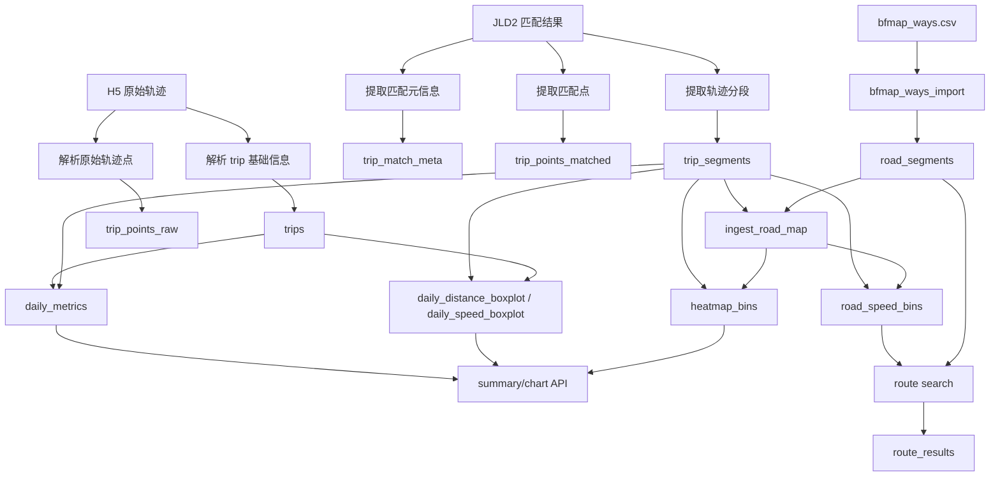
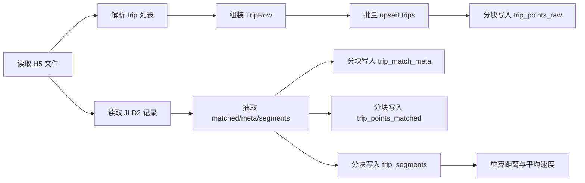
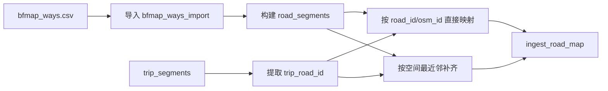
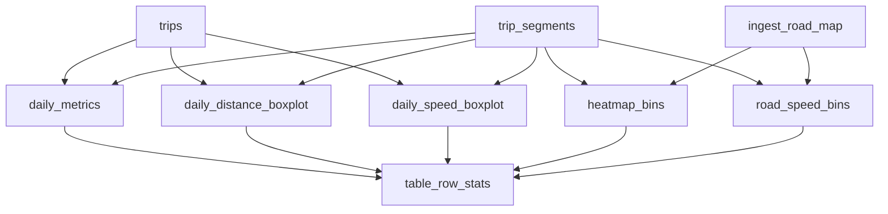
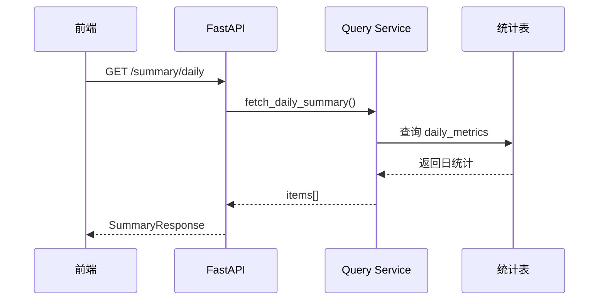
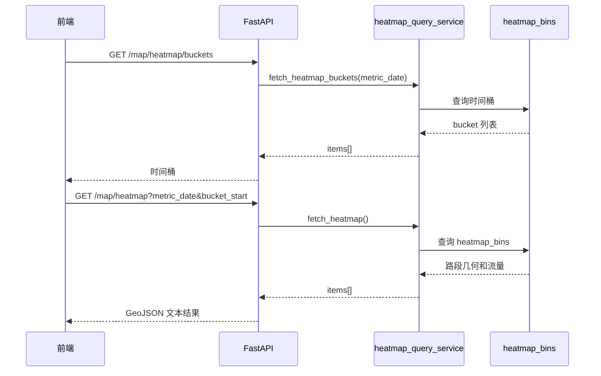

# 数据流与分层报告

本文档重点说明项目的数据来源、数据处理流程、数据表分层，以及与课程作业“四层数据体系”的对应关系。

## 1. 数据来源

项目当前依赖三类核心输入：

| 数据来源 | 文件位置 | 含义 | 在系统中的作用 |
| --- | --- | --- | --- |
| 原始轨迹数据 | `data/trips_*.h5` | 车辆轨迹原始点、设备、时间等信息 | 提供原始 trip 和 GPS 点 |
| 匹配结果数据 | `jldpath/trips_*.jld2` | 地图匹配后的道路 ID、分段几何、补点信息 | 生成匹配点、分段和道路关联 |
| 路网数据 | `bfmap_ways.csv` | BfMap 导出的边表 | 构建 `road_segments` 图和路径搜索主图 |

补充说明：

- `harbin.osm.pbf` 在仓库中存在，但当前主链路并不直接使用它。
- `scripts/prepare_data.sh` 负责从外部下载、解压并校验 `H5/JLD2` 数据。

## 2. 数据总流图

## 3. 入仓处理流程

### 3.1 轨迹入仓流程图

### 3.2 处理说明

| 步骤 | 主要实现 | 主要操作 |
| --- | --- | --- |
| 遍历源文件 | `source_file_pairs` | 将 `trips_150103.h5` 与同名 `jld2` 配对 |
| 并行分发任务 | `ingest_sources_parallel` | 按文件和 shard 数切分 worker |
| 解析 trip | `_ingest_one_file_task` | 读取设备号、时间戳、经纬度，构造 `TripRow` |
| trip 去重写入 | `upsert_trips_batch` | 借助临时表 `trips_stage`，按 `trip_uid` 去重 upsert |
| 原始点写入 | `_flush_pending_trips` | 分块 `COPY` 到 `trip_points_raw` |
| 匹配元信息写入 | `_extract_jld_rows` + `_flush_pending_trips` | 生成 `trip_match_meta` |
| 匹配点写入 | `_extract_jld_rows` + `_flush_pending_trips` | 生成 `trip_points_matched` |
| 分段写入 | `_extract_jld_rows` + `_flush_pending_trips` | 生成 `trip_segments` |
| 距离/速度补算 | `_recompute_segments_metrics` | 利用 `ST_Length` 回填距离和平均速度 |

## 4. 路网与统计处理流程

### 4.1 路网构建与映射

处理逻辑说明：

- 第一阶段按业务路段 ID 和路网边 `road_id/osm_id` 直接连接。
- 第二阶段对未映射路段，用分段中点和空间最近邻寻找 `road_segments`。
- 映射结果写入 `ingest_road_map`，供热力图和速度桶聚合使用。

### 4.2 统计聚合

各统计表的业务含义：

| 表名 | 作用 | 在线使用场景 |
| --- | --- | --- |
| `daily_metrics` | 每日总览指标，如行程数、车辆数、总里程、平均速度 | 总览页 KPI 和趋势图 |
| `daily_distance_boxplot` | 每日里程分布 | 总览页里程箱线图 |
| `daily_speed_boxplot` | 每日速度分布 | 总览页速度箱线图 |
| `heatmap_bins` | 每日、每 5 分钟、每路段的流量和距离 | 热力回放页面 |
| `road_speed_bins` | 每路段、每 5 分钟的速度统计 | 最快路径权重输入 |
| `table_row_stats` | 关键表行数与刷新时间统计 | 能力检测与巡检 |

## 5. 数据分层说明

### 5.1 项目内部数据分层

| 分层 | 主要对象 | 作用 |
| --- | --- | --- |
| 原始层 | `data/*.h5`、`jldpath/*.jld2`、`bfmap_ways.csv` | 离线输入，保留原始事实 |
| 明细层 | `trips`、`trip_points_raw`、`trip_match_meta`、`trip_points_matched`、`trip_segments` | 保存入仓后的结构化事实数据 |
| 路径层 | `bfmap_ways_import`、`road_segments`、`ingest_road_map`、`route_results` | 为路网映射和图搜索服务 |
| 统计层 | `daily_*`、`heatmap_bins`、`road_speed_bins`、`table_row_stats` | 为前端和 API 提供稳定读模型 |

### 5.2 与课程作业四层数据体系的映射

这里需要说明一个重要事实：

- 当前项目并没有完全按课程术语显式命名出 `ODS / DW / TDM / ADS` 四层目录或数据库 schema。
- 但从功能上可以做较清晰的近似映射。

对应说明：

| 作业层级 | 本项目中的近似对应 | 说明 |
| --- | --- | --- |
| ODS | 原始文件层 | `H5/JLD2/CSV` 被保留为贴源输入，不直接对前台服务 |
| DW | 明细层 + 路网基础层 | `trips/raw/matched/segments/road_segments` 承担统一清洗和结构化存储职责 |
| TDM | `ingest_road_map`、`road_speed_bins`、`table_row_stats` | 严格说不是传统“标签中心”，但承担了对象映射、速度特征和能力状态特征的角色 |
| ADS | `daily_metrics`、箱线图、`heatmap_bins`、`route_results` | 直接面向分析页面和接口服务 |

这里的 `TDM` 映射是基于项目实现做出的解释性归类，而不是源码中显式定义的层名。

## 6. 在线查询数据流

### 6.1 统计查询链路

### 6.2 热力图查询链路

## 7. 数据流的关键特点

- 先离线写库，再在线查询，保证前端体验稳定。
- 大表写入采用多进程 + 分块 `COPY`，避免逐行插入。
- 路径搜索依赖 `road_segments` 和 `road_speed_bins`，与明细层解耦。
- 热力图和总览均读取聚合表，不实时重算。
- 系统通过 `table_row_stats` 和 `route/capability` 暴露“当前能力是否已准备好”。

## 8. 小结

如果把这个项目理解为一个数据中台式作业实现，那么它的数据流可以概括为：

1. 将离线原始轨迹和匹配结果汇聚到统一存储。
2. 把事实数据加工成图搜索资产与统计读模型。
3. 把读模型通过 API 暴露给页面和路径服务。
4. 最终形成面向分析、可视化和路径评估的应用输出。
