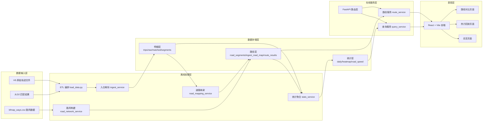
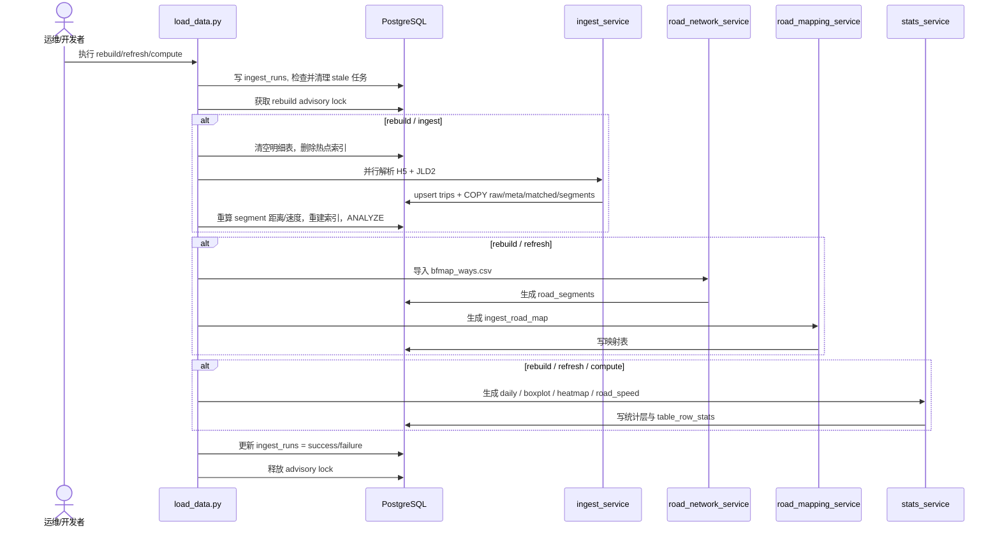
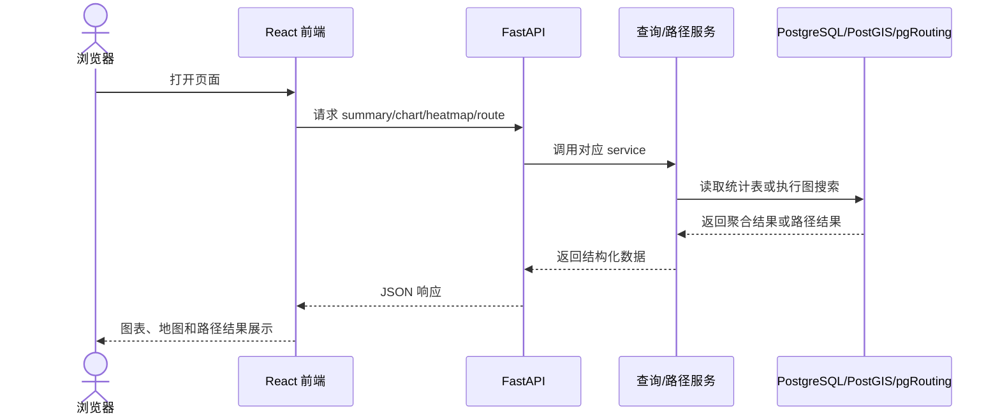

# 系统架构报告

本文档从系统模块、职责边界和主流程三个角度，梳理当前仓库的整体架构。内容基于代码实现与现有设计文档整理，适合用于汇报、课程作业说明和项目交接。

## 1. 系统目标

项目围绕“哈尔滨车辆轨迹分析”展开，目标是将原始车辆轨迹与地图匹配数据离线入仓，构建统计读模型和路径搜索能力，再通过 API 和前端页面把分析结果可视化输出。

系统不走“实时流处理”路线，而是采用“离线预计算 + 在线查询”的架构模式。

## 2. 总体架构图

## 3. 模块划分与职责

| 模块 | 代码位置 | 主要功能 | 执行的主要操作 | 主要输入 | 主要输出 |
| --- | --- | --- | --- | --- | --- |
| 应用入口 | `backend/app/main.py` | 启动 FastAPI 服务、挂载路由、健康检查 | 初始化应用、注册 CORS、暴露 `/healthz` | HTTP 请求 | API 服务实例 |
| API 路由层 | `backend/app/api/routes.py` | 对外提供统计查询、热力图、路径对比接口 | 参数校验、调用 service、组装响应模型 | 前端请求参数 | JSON 响应 |
| ETL 编排 | `backend/app/etl/load_data.py` | 调度全量构建与增量刷新流程 | 建运行记录、加锁、清表、执行入仓、路网构建、统计聚合 | `mode`、原始数据目录 | 入仓结果、统计表、运行日志 |
| 入仓服务 | `backend/app/services/ingest_service.py` | 解析 `H5/JLD2` 并写入明细层 | 解析字段、去重 upsert、分块 `COPY`、并行 worker 写库 | `H5`、`JLD2` | `trips`、`trip_points_raw`、`trip_match_meta`、`trip_points_matched`、`trip_segments` |
| 路网构建服务 | `backend/app/services/road_network_service.py` | 将 BfMap CSV 导入为可图搜索路网 | `COPY bfmap_ways_import`、构建 `road_segments`、生成长度和权重 | `bfmap_ways.csv` | `bfmap_ways_import`、`road_segments` |
| 道路映射服务 | `backend/app/services/road_mapping_service.py` | 建立业务路段与路网边的关联 | 先按 `road_id/osm_id` 直接映射，再按空间最近邻补齐 | `trip_segments`、`road_segments` | `ingest_road_map` |
| 统计聚合服务 | `backend/app/services/stats_service.py` | 生成在线查询需要的聚合结果 | 清空统计表、`INSERT SELECT` 聚合、`ANALYZE`、刷新表统计 | 明细层、路径层 | `daily_metrics`、箱线图、`heatmap_bins`、`road_speed_bins`、`table_row_stats` |
| 查询服务 | `backend/app/services/query_service.py` 及子模块 | 读取读模型并为 API 提供数据 | 查询日统计、箱线图、热力图时间桶和明细 | API 请求参数 | 面向前端的结构化数据 |
| 路径搜索服务 | `backend/app/services/route_service.py`、`route_search_service.py` | 计算最短路和最快路 | 能力检查、点吸附、5 分钟分桶、调用 `pgr_dijkstra`、写入 `route_results` | 起终点、查询时间 | 最短路 / 最快路结果 |
| 前端应用 | `frontend/src/App.tsx`、`frontend/src/api.ts` | 展示统计图表、热力回放、路径对比 | 请求 API、绘制图表、渲染地图、交互选点 | API 返回值 | 可视化页面 |

## 4. 核心执行流程

### 4.1 离线构建主流程

### 4.2 在线查询主流程

## 5. 关键设计思想

### 5.1 事实层与读模型分离

- 明细表只保留轨迹事实，不直接承担前台图表查询压力。
- 统计表提前聚合，前端和 API 尽量只读 `daily_*`、`heatmap_bins`、`road_speed_bins`。
- 路径搜索也不扫大明细表，而是依赖 `road_segments` 和 `road_speed_bins`。

### 5.2 路网模块独立

- `road_segments` 是路径搜索的主图。
- `ingest_road_map` 负责把业务侧的道路标识映射到图边。
- 这样统计与路径都可以围绕稳定的图结构工作，而不是直接依赖原始轨迹文件。

### 5.3 离线重计算优先

- 整体设计强调“先算好，再服务”。
- 代价是 `rebuild` 时间较长。
- 好处是在线查询更稳定，接口语义更简单，前端体验更流畅。

## 6. 模块和课程作业四大能力的映射

| 作业能力 | 项目中的对应模块 | 当前实现情况 |
| --- | --- | --- |
| 汇聚整合 | `scripts/prepare_data.sh`、`ingest_service` | 已实现，支持外部下载、结构校验、统一入仓 |
| 提纯加工 | `load_data.py`、`stats_service`、路网映射服务 | 已实现，完成清洗、分层存储、统计聚合 |
| 服务可视化 | FastAPI + React 前端 | 已实现，总览、热力图、路径对比可交互 |
| 价值变现 | 路径分析、交通态势分析、可视化决策支持 | 已体现为分析与决策支持价值，不是商业收费系统 |

## 7. 主要代码依据

- 应用入口：`backend/app/main.py`
- API 路由：`backend/app/api/routes.py`
- ETL 编排：`backend/app/etl/load_data.py`
- 入仓服务：`backend/app/services/ingest_service.py`
- 路网服务：`backend/app/services/road_network_service.py`
- 映射服务：`backend/app/services/road_mapping_service.py`
- 统计服务：`backend/app/services/stats_service.py`
- 路径服务：`backend/app/services/route_service.py`
- 前端主界面：`frontend/src/App.tsx`

## 8. 小结

从架构上看，这个项目可以理解为一个以空间数据库为中心的数据分析平台：

- 离线侧负责把“原始轨迹”提炼成“可查、可算、可视化”的读模型。
- 在线侧负责把这些读模型以 API 和页面的方式交付出来。
- 路径搜索模块独立于常规统计模块存在，是本项目区别于一般 BI 看板的关键特征。
