# 项目改进计划说明书

本文档用于把“项目评审报告”中的改进建议，进一步收敛为一份可执行、可排期、可验收的工程计划说明书。文档面向三类读者：

- 课程答辩成员：用于说明项目下一阶段如何从“分析平台原型”升级为“更完整的数据中台作业实现”。
- 项目开发成员：用于明确迭代顺序、改动范围、依赖关系和交付物。
- 评审教师或指导者：用于理解项目是否具备清晰的演进路线。

## 1. 计划背景

当前项目已经实现了以下核心能力：

- 原始轨迹数据与匹配结果入仓。
- 每日指标、箱线图、热力图等离线统计聚合。
- 基于 `pgRouting` 的最短路径与最快路径对比。
- 基于 React + FastAPI 的在线分析页面。

但从课程作业要求看，项目还存在以下关键差距：

- 四层数据体系更多停留在文档解释层，尚未在 schema、接口和模块边界上显式落地。
- 当前前端更像“分析工作台”，而不是“数据资产门户 + 数据大屏 + 服务中心”。
- 推荐服务和圈人服务尚未真正实现。
- 元数据管理、任务状态、资产目录等“中台感”能力不足。
- 测试基线和运维脚本存在工程性缺口，影响整体可信度。

因此，本计划的核心目标不是推翻现有项目，而是在保留现有主链路价值的前提下，以渐进式重构方式完成“课程作业补齐 + 架构规范化 + 产品化增强”。

## 2. 计划目标

### 2.1 总目标

将当前项目从“交通轨迹分析平台原型”升级为“具备显式四层数据体系、数据资产门户、分析服务、推荐服务、圈人服务和大屏展示能力的数据中台课程作业实现”。

### 2.2 分目标

本次改进计划包含六个分目标：

1. 修复工程基线问题，确保项目可回归、可迭代、可交付。
2. 建立元数据和资产状态能力，让页面由数据驱动而不是写死。
3. 将 `ODS / DW / TDM / ADS` 四层体系在工程上显式化。
4. 建立标签层与圈人能力。
5. 将现有路径分析升级为正式推荐服务。
6. 将前端升级为更完整的数据资产门户和大屏化产品。

## 3. 实施原则

为降低风险、控制复杂度，本计划遵循以下原则：

### 3.1 先稳后强

优先修复测试、脚本、环境、能力状态等基础问题，再做中台化增强和产品能力扩展。

### 3.2 渐进式演进

优先新增兼容层、新表、新接口和新页面，而不是直接推翻旧实现。先并存，再替换。

### 3.3 文档与代码同步

四层体系、服务边界、任务状态和资产目录必须同时体现在：

- 设计文档
- 数据库 schema
- API 接口
- 前端页面

### 3.4 在线查询只读读模型

无论后续增加多少新能力，前端和 API 都应优先读取 `ADS` 或明确的读模型，不回扫大明细表。

### 3.5 课程要求优先

优先完成“作业必做项”的显式落地，再投入“加分项”功能。

## 4. 总体目标架构

建议把现有架构演进为如下结构：

```mermaid
flowchart LR
  subgraph ODS["ODS 贴源层"]
    O1["原始 H5/JLD2/CSV 文件登记"]
    O2["原始载入记录 / 文件状态"]
  end

  subgraph DW["DW 统一数仓层"]
    D1["trips / raw points / matched points"]
    D2["trip_segments / road_segments"]
    D3["标准化时空事实表"]
  end

  subgraph TDM["TDM 标签特征层"]
    T1["车辆画像 / 车辆标签"]
    T2["道路画像 / 时段特征"]
    T3["区域活跃特征 / 分群结果"]
  end

  subgraph ADS["ADS 应用数据层"]
    A1["总览报表 / 大屏读模型"]
    A2["热力图 / 路径策略读模型"]
    A3["推荐结果 / 圈人结果"]
    A4["资产目录 / 状态读模型"]
  end

  subgraph APP["应用层"]
    P1["数据资产门户"]
    P2["分析中心"]
    P3["推荐中心"]
    P4["圈人中心"]
    P5["大屏模式"]
  end

  ODS --> DW
  DW --> TDM
  TDM --> ADS
  ADS --> APP
```



## 5. 改造范围

### 5.1 后端范围

- ETL 编排：`backend/app/etl/load_data.py`
- Service 层：`backend/app/services/`
- 路由层：`backend/app/api/routes.py`
- Schema 层：`backend/app/schemas.py`
- 数据库 schema：`infra/postgres/*.sql`
- 测试：`backend/tests/`

### 5.2 前端范围

- 工作台主界面：`frontend/src/App.tsx`
- API 封装：`frontend/src/api.ts`
- 新增页面与 feature 模块目录
- 交互状态和模块导航改造

### 5.3 文档范围

- 架构文档
- 数据分层文档
- 产品说明
- 项目评审报告
- 本计划说明书

## 6. 分阶段实施计划

以下阶段必须按顺序推进，后一个阶段默认依赖前一个阶段的基础能力。

---

## 7. 阶段 0：工程基线修复

### 7.1 阶段目标

确保当前仓库在统一环境下具备：

- 可运行
- 可测试
- 可排障
- 可稳定演示

### 7.2 主要问题

- 测试仍引用旧函数名，存在导入失败风险。
- 回归脚本依赖本机 `uv` 和 Python 环境，环境不一致时不稳定。
- `pg-fast-mode` 存在 `UNLOGGED` 持久化风险。
- 脚本与文档虽然较完整，但“环境自检”仍不足。

### 7.3 具体任务

1. 修复 `test_stats_orchestration.py` 对 `_step3_compute` 的旧引用问题。
2. 给 `scripts/regression.sh` 和相关 `Makefile` 目标增加环境检查。
3. 明确 `pg-fast-mode` 的使用范围，并在流程结束时恢复相关表为 `LOGGED`。
4. 补一份统一的“开发环境/测试环境说明”。
5. 补充最小回归执行路径：后端 smoke、前端 smoke、接口 smoke。

### 7.4 预计改动文件

- `backend/app/etl/load_data.py`
- `backend/tests/test_stats_orchestration.py`
- `scripts/regression.sh`
- `Makefile`
- `README.md`

### 7.5 阶段交付物

- 可执行的基础回归脚本
- 修复后的测试用例
- 更明确的环境说明
- `pg-fast-mode` 安全使用说明

### 7.6 验收标准

- 后端测试不再因旧函数导入直接失败。
- 脚本在依赖缺失时能给出明确提示。
- `pg-fast-mode` 不会把核心表长期留在 `UNLOGGED` 状态。

---

## 8. 阶段 1：元数据与资产状态层建设

### 8.1 阶段目标

建立“数据资产门户”的基础底座，让前端页面不再依赖写死日期和默认场景，而由后端元数据驱动。

### 8.2 为什么这一阶段必须先做

因为当前前端热力图日期、默认路线场景、可用范围等信息都写死在页面中，这会直接限制后续的门户化、扩展性和泛化能力。

### 8.3 设计方案

新增元数据层表：

- `meta_asset_catalog`
- `meta_asset_refresh_log`
- `meta_job_status`
- `meta_data_quality_check`
- `meta_available_time_range`

新增元数据接口：

- `GET /api/v1/meta/assets`
- `GET /api/v1/meta/dates`
- `GET /api/v1/meta/heatmap-buckets`
- `GET /api/v1/meta/jobs/latest`
- `GET /api/v1/meta/capability`

### 8.4 具体任务

1. 在数据库 schema 中新增元数据表。
2. 在 ETL 完成后写入资产更新时间、数据时间范围、任务状态。
3. 在后端新增元数据查询服务。
4. 前端改为从元数据接口动态拉取：
   - 可用日期
   - 热力图时间桶
   - 路径能力状态
   - 数据更新时间
5. 在前端新增“资产状态栏”或“当前数据状态提示”。

### 8.5 预计改动文件

- `infra/postgres/stats_schema.sql`
- `backend/app/services/`
- `backend/app/api/routes.py`
- `backend/app/schemas.py`
- `frontend/src/api.ts`
- `frontend/src/App.tsx`

### 8.6 阶段交付物

- 元数据表结构
- 元数据 API
- 动态日期和时间桶前端逻辑
- 数据状态展示组件

### 8.7 验收标准

- 热力图日期不再写死。
- 前端可根据后端返回结果动态渲染可用范围。
- 页面可展示最近更新时间、能力状态和任务状态。

---

## 9. 阶段 2：四层数据体系显式化

### 9.1 阶段目标

让课程作业中的 `ODS / DW / TDM / ADS` 不再只是解释性归类，而是成为工程中可明确指认的层次结构。

### 9.2 实施策略

本阶段不建议直接重命名现有全部表，而采用“新增分层实体 + 保持兼容”的方式推进。

### 9.3 推荐落地方式

#### ODS

- 原始文件登记表
- 文件下载/校验状态表
- 原始载入日志表

#### DW

- 现有 `trips`
- `trip_points_raw`
- `trip_points_matched`
- `trip_segments`
- `road_segments`

#### TDM

- `tdm_vehicle_profile`
- `tdm_vehicle_tag`
- `tdm_road_profile`
- `tdm_area_activity_profile`
- `tdm_time_bucket_feature`

#### ADS

- `ads_dashboard_daily`
- `ads_heatmap_replay`
- `ads_route_strategy`
- `ads_route_recommendation`
- `ads_vehicle_segments`
- `ads_asset_portal_summary`

### 9.4 具体任务

1. 定义四层数据对象清单。
2. 调整文档，明确每层输入、输出、服务对象。
3. 在数据库中新增 `TDM/ADS` 相关表。
4. 逐步把现有报表输出映射到 `ADS` 表。
5. 对现有 API 增加注释与契约约束，明确只读哪一层。

### 9.5 可选增强

若时间允许，可进一步使用不同 schema 显式隔离：

- `ods`
- `dw`
- `tdm`
- `ads`

如果时间有限，也可先用统一 schema + 命名前缀方式落地。

### 9.6 阶段交付物

- 四层体系表清单
- 四层体系结构图
- 新的 TDM/ADS 表
- 更新后的数据流文档

### 9.7 验收标准

- 能够明确展示每层的实体、职责和数据流。
- 新增能力不再直接依赖明细表拼接，而是通过 `TDM/ADS` 输出。
- 答辩时可以按表名而非概念解释四层体系。

---

## 10. 阶段 3：标签层与圈人服务建设

### 10.1 阶段目标

补齐课程要求中的“圈人服务”，同时让项目真正拥有 `TDM` 的核心价值。

### 10.2 为什么先做标签层

因为推荐服务、圈人服务、智能应用都需要特征和标签作为中间层。没有标签层，后续能力只能临时拼接，不具备中台复用价值。

### 10.3 首批建议标签

#### 车辆标签

- 高频通勤车
- 夜间活跃车
- 短途高频车
- 长途跨区车
- 高峰期活跃车

#### 道路标签

- 高拥堵路段
- 高波动路段
- 高流量路段
- 早高峰敏感路段
- 晚高峰敏感路段

#### 区域标签

- 高活跃区域
- 夜间活跃区域
- 通勤聚集区域

### 10.4 具体任务

1. 设计标签计算口径。
2. 在 ETL 或统计刷新后增加标签计算步骤。
3. 新增车辆画像和道路画像服务。
4. 新增圈人查询接口。
5. 前端增加“圈人中心”页面，支持：
   - 按标签筛选
   - 查看数量分布
   - 联动热力图

### 10.5 推荐接口

- `GET /api/v1/crowd/vehicles`
- `GET /api/v1/crowd/segments`
- `GET /api/v1/crowd/profile-summary`

### 10.6 阶段交付物

- 标签计算逻辑
- 标签表和画像表
- 圈人 API
- 圈人前端页面

### 10.7 验收标准

- 可查询车辆分群结果。
- 可按标签筛选车辆集合。
- 圈人结果可与热力图或总览联动展示。

---

## 11. 阶段 4：推荐服务建设

### 11.1 阶段目标

把当前“最短路 / 最快路对比”升级为正式的推荐服务，使其更符合课程对“推荐服务”的要求。

### 11.2 服务定位

当前项目不适合做实时导航推荐，因此推荐服务应定位为：

- 历史时段策略推荐
- 拥堵避让建议
- 最优出发时间建议

### 11.3 推荐能力设计

建议首批提供三种推荐能力：

1. 路径推荐
   - 输入：起点、终点、出发时段
   - 输出：建议路线、推荐理由、备选路线

2. 出发时间推荐
   - 输入：起点、终点、日期
   - 输出：推荐出发时间窗口

3. 拥堵规避建议
   - 输入：起点、终点、当前/计划时段
   - 输出：避让时段或避让路径建议

### 11.4 具体任务

1. 把当前路径服务的能力状态拆分为：
   - `graph_ready`
   - `dynamic_speed_ready`
   - `route_compare_ready`
2. 在推荐服务中增加推荐解释字段。
3. 增加推荐结果表，保留推荐过程可审计信息。
4. 新增推荐 API。
5. 前端新增“推荐中心”或在路径策略页加入推荐模块。

### 11.5 推荐接口

- `POST /api/v1/recommend/route`
- `GET /api/v1/recommend/departure-window`
- `GET /api/v1/recommend/congestion-avoidance`

### 11.6 阶段交付物

- 推荐结果读模型
- 推荐 API
- 推荐解释逻辑
- 推荐前端界面

### 11.7 验收标准

- 用户不再只看到两条路径，而能看到推荐结论和解释原因。
- 推荐结果能说明是否使用动态速度桶，还是静态回退。

---

## 12. 阶段 5：前端产品化重构

### 12.1 阶段目标

把当前单文件工作台重构为一个更清晰、更像“数据资产门户”的前端系统。

### 12.2 当前问题

- `App.tsx` 集中了总览、热力图、路径、地图初始化、状态管理等大量逻辑。
- 页面结构对课程展示足够，但不利于扩展门户、圈人、推荐、大屏等新能力。

### 12.3 目标页面结构

建议拆分为：

- `AssetPortalPage`
- `OverviewPage`
- `HeatmapReplayPage`
- `RouteStrategyPage`
- `RecommendationPage`
- `CrowdCenterPage`
- `BigScreenPage`

### 12.4 目标目录结构

```text
frontend/src/
  pages/
  features/meta/
  features/dashboard/
  features/heatmap/
  features/route/
  features/recommend/
  features/crowd/
  components/
```

### 12.5 具体任务

1. 拆分 `App.tsx`。
2. 建立页面级路由或内部模块切换结构。
3. 把地图能力拆为独立组件。
4. 把总览、热力图、路径、推荐、圈人各自封装成 feature。
5. 新增大屏模式：
   - 全屏展示
   - 自动轮播
   - 答辩模式

### 12.6 阶段交付物

- 结构化前端目录
- 资产门户页
- 推荐页
- 圈人页
- 大屏模式

### 12.7 验收标准

- 前端不再依赖一个超大单文件。
- 每个业务域有独立页面和组件边界。
- 可向教师明确展示“门户、分析、推荐、圈人、大屏”五类能力。

---

## 13. 阶段 6：测试、文档与答辩交付收口

### 13.1 阶段目标

把项目从“做出来”推进到“讲得清、测得过、交得出”。

### 13.2 具体任务

1. 补齐测试分类：
   - schema/etl
   - stats/query
   - route/recommend
   - crowd/tag
   - frontend
2. 增加元数据接口测试。
3. 增加标签与圈人结果测试。
4. 增加推荐结果契约测试。
5. 补充答辩用图：
   - 系统总体架构图
   - 四层体系图
   - 产品能力图
   - 主流程时序图
6. 补充答辩脚本和演示顺序。

### 13.3 阶段交付物

- 完整测试矩阵
- 演示脚本
- 答辩版汇报材料
- 更新后的总览文档

### 13.4 验收标准

- 项目可按固定顺序完成演示。
- 文档与代码表述一致。
- 教师可快速理解项目现状、优化点和课程对应关系。

## 14. 工程实施顺序总表

| 顺序 | 阶段 | 目标 | 是否必须先完成 |
| --- | --- | --- | --- |
| 1 | 阶段 0 | 工程基线修复 | 是 |
| 2 | 阶段 1 | 元数据与资产状态层 | 是 |
| 3 | 阶段 2 | 四层数据体系显式化 | 是 |
| 4 | 阶段 3 | 标签层与圈人服务 | 是 |
| 5 | 阶段 4 | 推荐服务 | 是 |
| 6 | 阶段 5 | 前端产品化重构 | 否，可与 4 后半段并行 |
| 7 | 阶段 6 | 测试、文档、答辩收口 | 是 |

## 15. 建议排期

若按 5 周推进，建议节奏如下：

### 第 1 周

- 完成阶段 0
- 启动阶段 1

### 第 2 周

- 完成阶段 1
- 完成阶段 2 的表设计和文档调整

### 第 3 周

- 完成阶段 2
- 启动阶段 3

### 第 4 周

- 完成阶段 3
- 启动阶段 4
- 同时启动阶段 5 的前端拆分

### 第 5 周

- 完成阶段 4
- 完成阶段 5
- 完成阶段 6 收口

## 16. 每阶段里程碑检查点

### 里程碑 M1：工程基线可用

- 测试基线修复
- 脚本自检完成
- 基础 smoke 可执行

### 里程碑 M2：门户底座完成

- 前端动态日期与动态时间桶已接入
- 资产状态和任务状态可见

### 里程碑 M3：四层体系成型

- `ODS / DW / TDM / ADS` 均有明确实体或表
- 文档、表、接口三者一致

### 里程碑 M4：圈人能力成型

- 至少一组车辆标签可查询
- 至少一个圈人页面可演示

### 里程碑 M5：推荐能力成型

- 推荐服务可输出推荐结果和推荐解释
- 能区分动态推荐与静态回退

### 里程碑 M6：答辩版系统成型

- 五类产品能力可展示
- 文档、图、页面、接口可自洽说明

## 17. 风险与应对

### 17.1 数据质量风险

风险：

- 原始数据缺失、匹配偏差、道路映射不稳会影响标签和推荐口径。

应对：

- 增加数据质量检查表和质量状态展示。

### 17.2 空间计算成本风险

风险：

- 路网映射、热力聚合和路径搜索在数据量增长后成本显著提高。

应对：

- 优先保持离线预计算架构，必要时再做分区和索引增强。

### 17.3 课程语义风险

风险：

- 交通场景与课程中台术语不完全一一对应。

应对：

- 用显式四层体系、标签层、推荐服务、圈人服务来增强一致性。

### 17.4 时间风险

风险：

- 阶段 3 到阶段 5 的工作量较大。

应对：

- 若时间不够，优先保证：
  - 工程基线
  - 元数据层
  - 四层体系
  - 最小可用圈人服务
  - 最小可用推荐服务

## 18. 优先级建议

如果只能做最关键的改进，优先级建议如下：

### P0 必做

- 阶段 0：工程基线修复
- 阶段 1：元数据与资产状态层
- 阶段 2：四层数据体系显式化

### P1 强烈建议做

- 阶段 3：标签层与圈人服务
- 阶段 4：推荐服务

### P2 加分项

- 阶段 5：前端产品化重构
- 阶段 6：答辩级图文与大屏收口

## 19. 最终预期成果

按本计划完成后，项目应具备以下成果：

- 一套更自洽的四层数据体系实现。
- 一个真正由数据驱动的资产门户。
- 一组可解释的推荐服务。
- 一组可展示的圈人服务。
- 一个可用于答辩展示的大屏模式。
- 一套更稳定的测试、脚本和文档体系。

最终，项目可以从“具备分析能力的课程原型”，提升为“结构完整、功能更全、课程对应关系更清晰的数据中台作业实现”。
