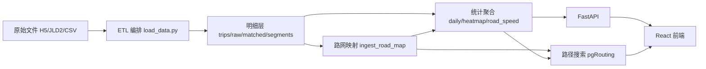

# 项目评审报告

本文档基于课程作业要求、仓库现有设计文档与源码实现，对本项目进行一次面向答辩和后续迭代的综合评审。重点回答六个问题：项目现状是什么、离作业要求还有哪些差距、当前实现存在哪些问题、如何优化产品功能、如何优化系统架构与模块交互、后续推进会面临哪些挑战。

## 1. 评审结论

这套系统已经具备一个“离线轨迹数据分析平台”的基本形态，完成了从原始轨迹文件入仓、统计聚合、热力回放到路径对比的主链路，整体架构思路是清晰的，工程拆分也比一般课程作业更完整。

如果从课程作业要求来评估，它目前更接近：

- **汇聚整合**：已实现。
- **提纯加工**：已实现主体能力，但四层数据体系更多是“解释性映射”，不是显式落地。
- **服务可视化**：已实现基础分析门户，但离“数据资产门户 + 数据大屏 + 推荐/圈人服务”还有明显差距。
- **价值变现**：已有“交通分析与策略支持”的雏形，但尚未形成更完整的业务闭环。

一句话总结：

“这是一个完成度较高的交通轨迹分析平台原型，但若要更好满足数据中台课程作业，需要从‘分析平台’进一步升级为‘具备数据资产门户、标签层、推荐/圈人能力和更规范分层接口的数据中台作业实现’。”

## 2. 评审依据与边界

本次评审主要依据以下内容：

- 作业要求：[作业要求](./作业要求.md)
- 架构文档：[系统架构报告](./系统架构报告.md)、[数据流与分层报告](./数据流与分层报告.md)、[产品说明与业务场景](./产品说明与业务场景.md)
- 后端实现：`backend/app/api/`、`backend/app/services/`、`backend/app/etl/`
- 数据库 schema：`infra/postgres/init.sql`、`infra/postgres/ingest_schema.sql`、`infra/postgres/stats_schema.sql`
- 前端实现：`frontend/src/App.tsx`、`frontend/src/api.ts`
- 测试与脚本：`backend/tests/`、`Makefile`、`scripts/*.sh`

评审边界说明：

- 本次以源码和文档审阅为主。
- 当前本地环境缺少可直接执行回归所需的 `uv`、`pytest` 与前端依赖，因此**未完成完整自动化回归实跑**。
- 结论中涉及“代码缺失/未实现”的部分，均以仓库当前源码为准。

## 3. 项目现状梳理

### 3.1 产品现状

当前系统已经落地了三类核心页面能力：

- 总览页：展示 KPI、每日趋势、里程/速度箱线图。
- 热力回放页：按日期和 5 分钟桶查看道路热度。
- 路径对比页：给定起终点与查询时间，对比最短路与最快路。

这说明项目已经从“单纯 ETL 作业”提升到了“离线分析 + 在线展示”的形态，具备较好的演示和答辩价值。

但从课程要求看，当前产品仍然偏“分析看板”，尚不是完整的数据资产门户。尤其在以下方面仍然偏弱：

- 缺少数据资产目录、数据表说明、接口目录、资产状态等门户能力。
- 缺少真正意义上的大屏化展示模式。
- 缺少明确的推荐服务与圈人服务。
- 缺少面向业务角色的闭环入口，如报表导出、分析报告中心、策略建议中心。

### 3.2 系统架构现状

当前架构主链路可以概括为：

这条链路有三个优点：

- 采用“离线预计算 + 在线查询”，在线读链路比较轻。
- 路径搜索与统计查询分开，边界较清晰。
- 前后端与数据库职责分离，模块组织总体合理。

当前也存在三个结构性问题：

- 文档中强调的大表分区和四层数据体系，在 schema 中并未显式落地。
- 在线服务层还缺少“元数据/资产管理/任务状态”这类中台化能力。
- 路由能力状态、统计准备状态、数据可用日期等元信息，没有形成统一的元数据服务。

### 3.3 模块交互现状

当前模块交互关系如下：

- `scripts/prepare_data.sh` 负责数据下载和目录准备。
- `backend/app/etl/load_data.py` 负责入仓、路网构建、统计刷新和流程编排。
- `backend/app/services/ingest_service.py` 负责 H5/JLD2 解析与明细写库。
- `road_network_service.py` 和 `road_mapping_service.py` 负责路网资产与映射资产。
- `stats_service.py` 负责生成总览、热力图和速度桶读模型。
- `query_service.py` 及子模块只读统计表。
- `route_service.py` / `route_search_service.py` 使用 `road_segments + road_speed_bins` 做路径计算。
- `frontend/src/App.tsx` 作为统一工作台页面消费 API。

当前交互边界总体清晰，但“中台作业”需要的元数据服务、标签服务、推荐服务、圈人服务尚未形成独立模块。

## 4. 与作业要求的对应评估

| 作业要求 | 当前实现方式 | 评估 |
| --- | --- | --- |
| 汇聚整合 | `prepare_data.sh` 下载数据，`ingest_service` 入仓，统一落 PostgreSQL/PostGIS | 已实现 |
| 预处理和清洗 | ETL 对轨迹、匹配点、分段进行解析、去重、补算距离与速度 | 已实现 |
| 四层数据体系接口 | 文档中做了 ODS/DW/TDM/ADS 的近似映射，但源码未显式按四层 schema/接口组织 | 部分实现 |
| 查询服务、报表、大屏 | 有 API、总览图表、热力图页面；但门户和大屏能力仍偏轻量 | 部分实现 |
| 数据分析服务 | 已有统计分析、热力回放、路径对比 | 已实现 |
| 推荐服务 | 目前主要体现在“最快路径”输出 | 弱实现 |
| 圈人服务 | 仓库中没有车辆标签/分群服务 | 未实现 |
| 价值变现 | 目前主要是“交通分析与策略支持”式价值说明 | 部分实现 |

核心判断：

- 项目已经覆盖了课程作业的主骨架。
- 但如果要在答辩里说“这是一个数据中台作业”，需要主动说明当前实现更偏“分析平台原型”，并给出中台化补强路线。

## 5. 主要问题

### 5.1 回归链路存在断裂，影响工程可信度

`backend/tests/test_stats_orchestration.py` 仍然导入 `_step3_compute`，但 `backend/app/etl/load_data.py` 里实际存在的是 `_step4_compute`。这意味着只要收集到该测试文件，后端全量回归就有较大概率直接在导入阶段失败。

证据：

- [backend/tests/test_stats_orchestration.py](/Users/apple/Desktop/Files/code/data_platform/backend/tests/test_stats_orchestration.py:11)
- [backend/tests/test_stats_orchestration.py](/Users/apple/Desktop/Files/code/data_platform/backend/tests/test_stats_orchestration.py:160)
- [backend/app/etl/load_data.py](/Users/apple/Desktop/Files/code/data_platform/backend/app/etl/load_data.py:100)

影响：

- 影响 `make test-backend` 这类“全仓回归”的可信度。
- 会削弱项目在答辩和交接时的工程说服力。

### 5.2 `pg-fast-mode` 存在数据持久化风险

源码中 `--pg-fast-mode` 会把多张核心表切换为 `UNLOGGED`，但在当前文件中没有看到对应的恢复为 `LOGGED` 的步骤。根据源码推断，只要开启该模式并执行成功，相关表可能长期处于非 WAL 保护状态。

证据：

- [backend/app/etl/load_data.py](/Users/apple/Desktop/Files/code/data_platform/backend/app/etl/load_data.py:49)
- [backend/app/etl/load_data.py](/Users/apple/Desktop/Files/code/data_platform/backend/app/etl/load_data.py:291)
- [backend/app/etl/load_data.py](/Users/apple/Desktop/Files/code/data_platform/backend/app/etl/load_data.py:469)

影响：

- 对课程作业演示问题不大，但对工程严谨性是明显风险。
- 一旦数据库异常重启，`UNLOGGED` 表可能丢失数据。

### 5.3 文档设计与真实 schema 存在偏差，四层分层和分区还没有真正落地

设计文档和实施总纲多次强调“按日期分区”和“四层数据体系”，但数据库 schema 当前仍是普通表结构，没有 `PARTITION BY`，也没有显式的 `ODS/DW/TDM/ADS` schema 或接口边界。

证据：

- [docs/作业要求](./作业要求.md)
- [docs/数据流与分层报告](/Users/apple/Desktop/Files/code/data_platform/docs/数据流与分层报告.md:160)
- [infra/postgres/ingest_schema.sql](/Users/apple/Desktop/Files/code/data_platform/infra/postgres/ingest_schema.sql:1)
- [infra/postgres/stats_schema.sql](/Users/apple/Desktop/Files/code/data_platform/infra/postgres/stats_schema.sql:1)

影响：

- 课程作业层面只能说“功能近似映射”，不能说“规范落地了四层接口”。
- 随数据量上升，维护、裁剪和性能优化空间会受到限制。

### 5.4 前端对数据日期和初始场景存在硬编码，平台泛化能力不足

热力图页面的日期直接写死为 `2015-01-03` 到 `2015-01-07`，路径对比默认时间和坐标也写在前端常量中。这使页面实际上绑定了当前样例数据，不利于扩展到其他日期范围或其他城市/样本集。

证据：

- [frontend/src/App.tsx](/Users/apple/Desktop/Files/code/data_platform/frontend/src/App.tsx:185)
- [frontend/src/App.tsx](/Users/apple/Desktop/Files/code/data_platform/frontend/src/App.tsx:255)
- [frontend/src/App.tsx](/Users/apple/Desktop/Files/code/data_platform/frontend/src/App.tsx:1017)
- [backend/app/api/routes.py](/Users/apple/Desktop/Files/code/data_platform/backend/app/api/routes.py:117)

影响：

- 一旦换数据集，热力图入口很可能直接不可用或表现异常。
- 与“数据资产门户”的定位不一致，因为门户应该由后端元数据驱动，而不是写死在页面里。

### 5.5 服务可视化与价值变现层仍未满足课程要求的完整形态

文档已经明确承认：当前项目没有传统意义上的推荐服务和圈人服务，页面也更接近“轻量分析门户”而非完整大屏。这说明项目当前在服务化和价值化上仍是“部分满足”。

证据：

- [docs/作业要求](/Users/apple/Desktop/Files/code/data_platform/docs/作业要求.md:16)
- [docs/产品说明与业务场景](/Users/apple/Desktop/Files/code/data_platform/docs/产品说明与业务场景.md:182)
- [docs/产品说明与业务场景](/Users/apple/Desktop/Files/code/data_platform/docs/产品说明与业务场景.md:191)

影响：

- 答辩时如果直接宣称“完成了全部中台能力”，说服力不足。
- 需要把“已实现分析平台”和“待补齐中台能力”明确区分开。

## 6. 优化方案

### 6.1 产品功能优化

建议把当前三页工作台升级为“数据资产门户 + 分析中心 + 策略中心”的产品形态。

建议补充的功能：

- **数据资产门户**
  - 数据表目录、字段说明、更新时间、样本量、接口目录。
  - 可用日期、可用时间桶、资产状态、路径能力状态统一展示。
  - 接口示例、数据说明和导出入口。
- **数据报表与大屏**
  - 新增全屏驾驶舱模式，展示 KPI、拥堵路段 TopN、活跃区域、时段趋势。
  - 支持自动轮播、答辩模式、截图/导出报告。
- **推荐服务**
  - 从“最快路径”扩展为“时段绕行建议”“拥堵避让建议”“历史最优出发时间建议”。
  - 明确告诉用户推荐依据是历史速度桶而非实时导航。
- **圈人服务**
  - 面向车辆建立标签，如高频通勤车、夜间活跃车、短途高频车、长途跨区车。
  - 支持按标签筛选并联动热力图和路径分析。
- **智能应用**
  - 异常出行检测、重点区域活跃车辆识别、道路拥堵风险预警。

### 6.2 系统架构优化

建议把当前“原始层/明细层/路径层/统计层”的实现，升级为更贴近课程要求的显式四层架构：

#### 方案一：按 schema 显式分层

- `ods_*`：保存原始 H5/JLD2/CSV 的结构化贴源表。
- `dw_*`：保存统一清洗后的轨迹、匹配点、分段、基础路网。
- `tdm_*`：保存车辆标签、道路画像、时段速度特征、活跃区域特征。
- `ads_*`：保存大屏、报表、推荐、圈人所需的聚合结果。

这样做的收益：

- 更容易向课程作业解释“我们确实做了四层体系”。
- 更容易控制哪些表可以被 API 读取，哪些表只作为中间产物。

#### 方案二：补齐元数据和资产状态层

建议新增：

- `asset_catalog`
- `asset_refresh_log`
- `data_quality_check`
- `job_status`

这些表可以支撑：

- 门户展示数据资产状态。
- 任务编排状态可视化。
- 作业失败重试和数据质量巡检。

#### 方案三：补齐分区与运维能力

- 对 `trips`、`trip_points_raw`、`trip_points_matched`、`trip_segments`、`heatmap_bins` 落地按日期分区。
- 将“设计文档中的分区策略”真正落实到 SQL schema。
- 对统计刷新和大表入仓增加更明确的维护脚本与校验脚本。

### 6.3 模块交互优化

建议把现有模块交互从“功能能跑通”升级为“能力状态可管理、接口可扩展”。

推荐调整如下：

1. `ETL -> 元数据服务`
   - 每次 `rebuild/refresh/compute` 后不仅写 `ingest_runs`，还更新资产目录、数据时间范围、刷新时间和数据质量结果。

2. `元数据服务 -> 前端门户`
   - 提供 `available_dates`、`available_buckets`、`asset_status`、`job_status` 等接口。
   - 前端不再写死日期与默认样例，而是动态拉取。

3. `TDM -> ADS`
   - 先做标签和特征层，再生成大屏与推荐结果。
   - 推荐服务、圈人服务直接读取 `tdm_*` 和 `ads_*`，而不是临时拼逻辑。

4. `路径服务 -> 能力状态语义优化`
   - 当前 `route_capability.ready` 不要求 `speed_bins_ready`，容易让用户误以为“最快路”一定基于时段速度。
   - 建议拆分为：
     - `graph_ready`
     - `dynamic_speed_ready`
     - `route_compare_ready`
   - 前端要明确展示“当前是否为动态最快路，还是静态回退结果”。

### 6.4 工程与测试优化

建议优先补齐以下工程改进：

- 修复测试中对 `_step3_compute` 的旧引用。
- 回归脚本增加环境自检，避免 `uv`、依赖缺失时直接失败。
- 如果启用 `pg-fast-mode`，结束后应显式恢复核心表为 `LOGGED`。
- 将回归测试尽量容器化，减少“依赖本机 Python/Node 环境”的不确定性。
- 增加前后端联调级测试：
  - 热力图日期动态加载测试
  - 路径能力回退语义测试
  - 数据资产门户元数据接口测试

## 7. 面临的挑战

后续优化过程中，主要会面临以下挑战：

- **数据质量挑战**
  - 原始轨迹和匹配结果的一致性、缺失值、坐标异常会直接影响聚合口径和路径结果。
- **空间计算复杂度**
  - 路网映射、热力图聚合、pgRouting 都依赖空间计算，随着规模上升成本会明显增加。
- **课程要求与业务语义不完全同构**
  - 课程中的“推荐服务、圈人服务”偏中台通用语义，而当前项目是交通轨迹场景，需要做场景化解释和重构。
- **离线架构与实时诉求的权衡**
  - 当前架构适合展示和分析，但不适合实时导航、实时告警。
- **环境一致性挑战**
  - 当前测试与脚本运行对本机工具链仍有依赖，环境差异会影响交付稳定性。

## 8. 未来工作建议

### P0：先补“作业达标”和“工程可信”

- 修复测试断裂问题，保证全量回归可执行。
- 新增元数据接口，移除前端硬编码日期。
- 明确 `route_capability` 的动态能力语义。
- 在文档中把“已实现能力”和“近似映射能力”分开表述。

### P1：补齐中台化核心能力

- 显式落地 `ODS/DW/TDM/ADS` 分层。
- 建立车辆标签与道路画像。
- 增加推荐服务、圈人服务的最小可用版本。
- 增加数据资产门户与大屏模式。

### P2：补齐业务闭环和价值输出

- 形成“拥堵诊断报告”“时段绕行建议”“重点车辆分群分析”等可交付结果。
- 增加报表导出、报告中心和答辩展示模式。
- 评估实时数据接入、告警和调度闭环的演进路线。

## 9. 最终结论

当前项目最大的优点是：主链路完整、主题鲜明、空间分析特色明显，已经具备较强的课程展示价值。

当前项目最大的短板是：它更像“交通分析平台”，还不是“规范化数据中台作业”。

因此最合理的评审结论应该是：

- **技术实现质量：中上**
- **课程要求覆盖度：中等偏上**
- **产品完成度：中等**
- **后续优化空间：很大**

如果按建议补齐四层分层、元数据门户、推荐/圈人服务和工程回归，这个项目完全可以从“能演示”提升到“能答辩、能讲清、能自圆其说”的优秀作业版本。
