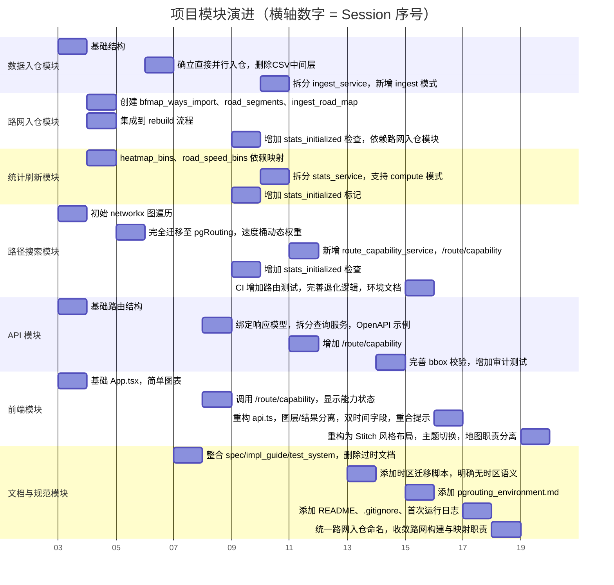

## 各 Session 详细分析

### 1. `ses_2f5d87f56ffe4kXPaykPnjwOuF.json`  
**时间：2026-03-21 16:26:07**

**实现目标：**  
创建项目基础骨架，建立前后端基础代码和依赖管理。

**所做探索与变更：**  
- 创建了项目根目录下的 `Makefile`，定义 `test`、`test-backend`、`test-frontend` 等命令。  
- 在 `backend/` 下初始化 Python 项目，生成了 `pyproject.toml` 和 `uv.lock`，依赖包括 FastAPI、SQLAlchemy、psycopg、h5py、numpy、networkx 等。  
- 在 `frontend/` 下初始化 React + Vite 项目，生成了 `package.json`、`package-lock.json`、`vite.config.ts` 等，依赖包括 maplibre-gl、recharts 等。  
- 编写了第一个版本的 `infra/postgres/init.sql`，包含了所有核心表的创建语句（trips, trip_points_raw, trip_match_meta, trip_points_matched, trip_segments, daily_metrics, heatmap_bins, route_results 等）。  
- 在 `backend/app/` 中创建了基础模块：`main.py`（FastAPI 入口）、`api/routes.py`（占位路由）、`db/models.py`（SQLAlchemy 模型）、`db/session.py`、`core/config.py`、`etl/load_data.py`（空的 ETL 入口）、`services/query_service.py`（基础查询函数）。  
- 在 `frontend/src/` 中创建了 `App.tsx`（一个简单的展示页，包含 KPI 卡片和图表占位符）、`App.css`（基础样式）。  

**方案采用/废弃原因：**  
此 Session 仅建立了最基础的代码结构，没有引入任何复杂的架构决策，属于项目的“脚手架”阶段。

---

### 2. `ses_2f078f792ffeGyray06C1vs0ln.json`  
**时间：2026-03-21 17:09:45**

**实现目标：**  
引入路网入仓模块作为 pgRouting 的主图源，并建立入仓路段到路网边的映射关系。

**所做探索与变更：**  
- 新增 `bfmap_ways_import` 表，用于直接导入 `bfmap_ways.csv` 原始数据。  
- 新增 `ingest_road_map` 表，用于存储入仓路段 ID 到 BfMap 路段 ID 的映射。  
- 创建了两个新服务：  
  - `road_network_service.py`：负责从 CSV 导入路网数据，并构建 `road_segments` 表（填充 `source_node`、`target_node`、`cost`、`reverse_cost` 等 pgRouting 所需字段）。  
  - `road_mapping_service.py`：负责根据 `trip_segments.road_id` 与 `bfmap_ways_import.gid` 的匹配，生成映射关系。  
- 在 `load_data.py` 的 `rebuild` 模式中，加入了路网入仓模块步骤，统一完成 `bfmap_ways.csv` 导入、`road_segments` 构建与 `ingest_road_map` 生成。  
- 在 `stats_service.py` 中，将 `heatmap_bins` 和 `road_speed_bins` 的生成改为依赖 `ingest_road_map`，确保统计指标与路网入仓模块对齐。  

**探索与决策：**  
- **采用原因**：原先的路径搜索依赖 `trip_segments` 构建的图，但 `trip_segments` 是轨迹数据派生的，无法保证路网拓扑的完整性。路网入仓模块能够提供完整的图结构，是路径搜索的正确基础。  
- **废弃的尝试**：在此之前（可能在更早的未记录会话中）曾尝试直接使用 OSM 路网，但 OSM 数据与轨迹匹配的 `road_id` 不一致，导致映射困难。当前采用统一的 `gid` 作为 `road_id`，与入仓数据中的 `road_id` 字段（来自 JLD2 的 `roads` 数组）天然对应，因此选择该方案。

---

### 3. `ses_2f054e5c6ffeQhw1GOQxFDwTme.json`  
**时间：2026-03-21 22:16:29**

**实现目标：**  
彻底将路由模块从 Python `networkx` 迁移到数据库 `pgRouting`，并实现速度桶动态权重和退化逻辑。

**所做探索与变更：**  
- **移除 `networkx` 相关代码**：`route_service.py` 中原先使用 `networkx` 构建图并进行最短路径计算的代码被全部删除。  
- 新增 `route_capability_service.py`，用于检查 pgRouting 扩展是否可用以及 `road_segments` 图是否就绪。  
- 重构 `route_search_service.py`，将 Dijkstra 算法的调用完全改为 `pgRouting` 的 SQL 函数：  
  - 最短路：使用 `road_segments.length_m` 作为 cost。  
  - 最快路：动态关联 `road_speed_bins` 表，根据 `query_time` 命中 5 分钟速度桶，计算时间成本。  
- 在 `route_service.py` 中实现了**退化逻辑**：当请求时间桶无速度数据时，最快路退化为静态权重（即使用 `road_segments.travel_time_s`），并确保与最短路一致。  
- 增加了 `route/compare` 接口中 `query_time` 参数的必要性校验。  

**探索与决策：**  
- **采用原因**：Python `networkx` 在数据量较大时性能差，且无法利用数据库的空间索引。将计算下沉到数据库可以大幅提升性能，并简化代码。  
- **废弃的尝试**：之前曾在 Python 中动态构建 SQL 字符串来拼接 `CASE WHEN` 语句实现动态权重，但这种方式存在 SQL 注入风险且难以维护。最终采用了在数据库内通过 `LEFT JOIN road_speed_bins` 和 `COALESCE` 来优雅地处理权重计算。

---

### 4. `ses_2ef028b27ffe0VGMUOumnlVEth.json`  
**时间：2026-03-22 00:45:01**

**实现目标：**  
**架构最终定型**：放弃 CSV 中间层方案，回归“H5/JLD2 直接并行 chunk COPY 到 PostgreSQL”的简洁架构。

**所做探索与变更：**  
- 删除了 `staging/csv/` 目录以及所有 CSV 生成相关代码。  
- 将 `load_data.py` 中的 `step1_generate_csv` 和 `step2_ingest_from_csv` 等函数移除，恢复了直接使用 `ProcessPoolExecutor` 并行处理源文件的逻辑。  
- 在 `agent.md` 中新增了“执行追踪与心跳约定”，要求 AI 在执行长任务（如入仓）时必须输出时间戳和进度。  
- 在 `project_context.md` 中更新了数据流描述，明确“每个 worker 负责一个源文件的打开、分块转换、chunk COPY、关闭”的规则。  

**探索与决策：**  
- **废弃的尝试（CSV 中间层）**：在之前的 Session（如 `ses_2eeaa81a2ffeFARva1CKTJxKHL.json`）中，曾尝试将 H5/JLD2 转换为 CSV 文件，再通过 COPY 导入 PostgreSQL。这一方案是为了提高可重复性和调试便利性，但带来了额外的磁盘 I/O 和转换开销，且增加了代码复杂度。  
- **采用原因**：最终选择直接入仓，因为：
  1. 性能更好（减少一次文件写入和读取）。  
  2. 代码更简洁（无需维护 CSV 生成和读取逻辑）。  
  3. PostgreSQL 的 COPY 可以直接处理二进制流，通过 Python 的 `cur.copy()` 即可实现高效写入。  
- **心跳约定**：这是为了应对未来可能的长时间任务（如全量重建），确保 AI 在任务执行期间能持续反馈进度，避免用户误以为任务卡死。

---

### 5. `ses_2eeaa81a2ffeFARva1CKTJxKHL.json`  
**时间：2026-03-22 08:52:25**

**实现目标：**  
**文档体系整合**，将所有分散的设计文档统一为三份核心文档，并删除过时文件。

**所做探索与变更：**  
- 将 `agent.md`、`test_case_mapping.md`、`test_plan.md` 中的核心内容提炼并整合到 `spec.md`、`implementation_guide.md`、`test_system.md` 中。  
- 删除了 `agent.md`、`test_case_mapping.md`、`test_plan.md` 等文件，避免信息碎片化。  
- 更新了所有子目录的 `README.md`，使其指向这三份核心文档。  
- 在 `spec.md` 中补充了路径搜索方案的详细说明，包括速度桶命中、退化策略、无时区时间处理等。  
- 在 `implementation_guide.md` 中明确了模块边界和依赖关系，特别是路网入仓模块的职责。  
- 在 `test_system.md` 中按模块重新组织了测试用例，并明确了回归测试的范围。  

**探索与决策：**  
- **采用原因**：项目文档最初分布在多个文件中，内容重叠且难以维护。统一为三份核心文档后，可以确保设计原则、实施细节和测试策略各司其职，便于后续开发和审查。  
- **废弃的文档**：`agent.md` 原本是为了指导 AI 行为，但其内容与项目设计高度重叠，因此被合并；`test_plan.md` 和 `test_case_mapping.md` 的内容被整合到 `test_system.md` 中，以简化测试管理。

---

### 6. `ses_2ecf68d6fffeUXSqV06A3gboSp.json`  
**时间：2026-03-22 09:48:00**

**实现目标：**  
**API 规范化与服务拆分**，为所有接口绑定 Pydantic 响应模型，并将查询服务按职责拆分。

**所做探索与变更：**  
- 在 `backend/app/schemas.py` 中新增了 `SummaryResponse`、`DateValueResponse`、`BoxplotResponse`、`HeatmapResponse`、`RouteCapabilityResponse`、`RouteCompareResponse` 等多个响应模型。  
- 在 `api/routes.py` 中为每个端点添加了 `response_model` 参数，并提供了 OpenAPI 示例（`SUMMARY_EXAMPLE`、`ROUTE_COMPARE_REQUEST_EXAMPLE` 等）。  
- 将原本单一的 `query_service.py` 拆分为三个独立服务：  
  - `summary_query_service.py`：只负责 `daily_summary` 查询。  
  - `chart_query_service.py`：负责所有图表类查询（trip count, vehicle count, distance, boxplots）。  
  - `heatmap_query_service.py`：负责热力图相关查询。  
- `query_service.py` 变为一个兼容层，仅导出这些服务的函数，避免破坏原有调用方。  
- 在 `route/compare` 接口中增加了对 `ValueError` 的统一映射，返回 HTTP 400。  

**探索与决策：**  
- **采用原因**：  
  - **响应模型**：避免 API 返回结构随意变化，保证前后端契约稳定。  
  - **服务拆分**：遵循“单一职责原则”，使每个服务更易测试和维护。  
  - **OpenAPI 示例**：提升 API 文档的可读性，方便前端开发。  
- **废弃的尝试**：曾考虑将所有查询逻辑放在 `api/routes.py` 中，但会导致路由文件臃肿，因此最终选择了服务拆分。

---

### 7. `ses_2ecc323e8ffentLINIS2zAvvUz.json`  
**时间：2026-03-22 10:05:35**

**实现目标：**  
增强路由能力检查，增加统计模块初始化状态的校验，并添加相关测试。

**所做探索与变更：**  
- 在 `RouteCapabilityResponse` 中新增 `stats_initialized` 字段，表示统计模块是否已初始化（通过检查 `table_row_stats` 中是否有 `road_speed_bins` 的记录）。  
- 在 `route_capability_service.py` 中增加对 `table_row_stats` 的查询，填充 `stats_initialized`。  
- 在 `route_search_service.py` 的 `ensure_routing_ready` 函数中，新增对 `stats_initialized` 的检查，如果未初始化则抛出错误。  
- 添加了两个新的测试文件：  
  - `test_pipeline_modes_ingest.py`：测试 `ingest` 模式（只入仓）不会影响统计表和路径表。  
  - `test_stats_orchestration.py`：测试统计刷新会正确清理并重建 `road_speed_bins` 等统计表。  
- 在 `route_search_service.py` 中，将 `pgr_dijkstra` 的 SQL 改用 `quote_literal` 构建，避免 SQL 注入风险。  

**探索与决策：**  
- **采用原因**：  
  - 统计模块的初始化状态直接影响路径搜索的正确性（速度桶数据由统计模块生成）。增加 `stats_initialized` 检查可以防止在统计未就绪时调用路径搜索导致错误或退化逻辑失效。  
  - 新增的测试确保了入仓和统计编排的独立性，为未来的重构提供安全保障。  
- **废弃的尝试**：曾考虑直接检查 `road_speed_bins` 是否有数据，但统计模块可能尚未运行过，导致误判。通过检查 `table_row_stats` 可以更准确地知道统计模块是否执行过。

---

### 8. `ses_2ecb0b863ffeUHSts6mumfjiEm.json`  
**时间：2026-03-22 10:39:25**

**实现目标：**  
ETL 流程优化，将 `load_data.py` 中的大量函数拆分到独立服务，并新增 `ingest` 运行模式。

**所做探索与变更：**  
- 将 `load_data.py` 中的 `_ingest_one_file_task`、`_flush_pending_trips`、`upsert_trips_batch` 等函数迁移到 `ingest_service.py` 中。  
- 将统计聚合函数迁移到 `stats_service.py` 中。  
- 在 `load_data.py` 中新增 `_step_ingest_only` 函数，用于实现 `ingest` 模式（仅入仓，不刷新统计）。  
- 在 `run_pipeline` 中增加了 `mode == "ingest"` 的分支，该分支会获取锁、清理明细表、并行入仓、重建索引、analyze，然后退出，**不执行统计刷新和路网入仓模块**。  
- 在 `pyproject.toml` 中添加了 `networkx` 依赖（因为之前曾使用过），但后来在 `ses_2f054e5c6ffe...` 中已移除。  
- 在 `test_system.md` 中补充了路径搜索模块的测试规范，明确了速度桶命中、回退逻辑、无时区时间处理等测试要点。  

**探索与决策：**  
- **采用原因**：  
  - **模块化**：将 ETL 逻辑从单一文件中分离，使 `load_data.py` 更专注于流程编排，便于维护。  
  - **`ingest` 模式**：允许只执行入仓而不刷新统计，这在开发调试时非常有用（例如只想验证数据入库是否正确，无需等待统计刷新）。  
- **废弃的尝试**：曾考虑将入仓和统计完全解耦为两个独立的脚本，但这样会增加调用复杂度。最终选择在一个脚本内通过 `mode` 参数控制，保持了使用便利性。

---

### 9. `ses_2ec95a79fffeepb1nc7hgyp0pF.json`  
**时间：2026-03-22 11:44:28**

**实现目标：**  
**正式引入 pgRouting 路由服务**，实现基础的路由能力检查 API，并为后续测试铺路。

**所做探索与变更：**  
- 在 `backend/app/services/` 下新增 `route_capability_service.py`，提供 `get_route_capability` 函数。  
- 在 `api/routes.py` 中新增 `/route/capability` 端点，返回路由能力状态。  
- 在 `backend/tests/` 下新增 `test_route_capability.py`，测试该端点的返回字段。  
- 新增 `test_route_database_search.py`，包含最基础的路由搜索测试（需要 pgRouting 可用）。  
- 在 `route_service.py` 中引入了 `run_pgr_dijkstra` 和 `nearest_graph_node` 等函数，但此时仍保留了一部分 `networkx` 代码（在后续 Session 中被完全移除）。  

**探索与决策：**  
- **采用原因**：路由能力检查 API 可以让前端在调用 `/route/compare` 之前先确认后端是否已准备好（pgRouting 扩展是否安装、`road_segments` 是否有数据），避免无谓的错误请求。  
- **废弃的尝试**：最初考虑在 `/route/compare` 中直接返回错误，但这样前端无法预知问题原因，用户体验较差。能力检查 API 让前端可以提前显示提示信息（例如“路由服务未就绪，请先运行 rebuild”）。

---

### 10. `ses_2ec50ff85ffegS0zpnSwB3epis.json`  
**时间：2026-03-22 11:55:29**  
**状态：空 Session，无实际代码变更。**

---

### 11. `ses_2ec4edfd4ffeihUQN6KFl6eM7O.json`  
**时间：2026-03-22 13:59:05**

**实现目标：**  
**数据库 Schema 规范化**，将所有业务时间字段改为无时区类型，并提供迁移脚本。

**所做探索与变更：**  
- 在 `db/models.py` 中将 `start_time`、`end_time`、`event_time` 等字段从 `TIMESTAMP(timezone=True)` 改为 `TIMESTAMP(timezone=False)`。  
- 创建了 `infra/postgres/migrate_timezone_agnostic.sql` 迁移脚本，该脚本会将现有 `timestamptz` 数据转换为业务时区的无时区时间（默认 Asia/Shanghai）。  
- 在 `implementation_guide.md` 中更新了模块地图，将路网入仓模块正式纳入统计流程的前置依赖。  
- 在 `spec.md` 中补充了“路径链路采用无时区 datetime 语义”的说明。  

**探索与决策：**  
- **采用原因**：  
  - 轨迹数据的时间戳本质上都是“当地时间”（没有时区转换需求），使用 `timestamp` 可以避免 PostgreSQL 自动进行时区转换带来的混淆。  
  - 分桶计算（如 5 分钟速度桶）是基于钟面时间，与时区无关，使用 `timestamp` 更直观。  
- **废弃的尝试**：曾考虑保留 `timestamptz` 并在应用层统一转换为 Asia/Shanghai，但这样会增加应用层复杂性，且容易出错。最终选择在数据库层直接存储无时区时间，并通过迁移脚本处理存量数据。

---

### 12. `ses_2ebddfb1bffeMbJhT21sN8BNdc.json`  
**时间：2026-03-22 15:13:17**

**实现目标：**  
**API 层增强**，完成之前未完成的查询服务拆分，并增加速度桶退化逻辑的验证。

**所做探索与变更：**  
- 正式将 `query_service.py` 按职责拆分为三个独立服务，并更新了所有调用点。  
- 在 `route_service.py` 的 `_run_pgr_dijkstra` 中完善了速度桶缺失时的退化逻辑，确保使用静态 `travel_time_s` 计算。  
- 在 `api/routes.py` 中为 `heatmap` 端点增加了 bbox 参数校验（必须同时提供四个值，且 min <= max）。  
- 在 `test_api_contract.py` 中增加了对 `summary/daily` 端点的审计测试，确保它不会查询明细表（通过 SQL 事件监听）。  

**探索与决策：**  
- **采用原因**：  
  - **服务拆分**：使代码更符合“薄控制器”原则，便于单元测试。  
  - **退化逻辑**：确保即使速度桶数据缺失，路由服务也能正常返回结果（只是最快路与最短路相同），提升鲁棒性。  
  - **审计测试**：防止后续开发中不小心让 API 回扫明细大表，保证性能。

---

### 13. `ses_2eb9a186effeoCNR5UNqXAWP38.json`  
**时间：2026-03-23 00:10:07**

**实现目标：**  
**完善路由搜索逻辑和测试体系**，增加 CI 中的路由测试，并补充文档。

**所做探索与变更：**  
- 在 `.github/workflows/regression.yml` 中为 `backend-tests` 作业增加了 `Run pgRouting route suite` 步骤，确保 CI 环境也测试路由功能。  
- 在 `route_search_service.py` 中增加了 `has_speed_bins_for_bucket` 辅助函数，并在 `compare_routes` 中根据该函数的返回值决定是否使用速度桶。  
- 在 `route_capability_service.py` 中增加了对 `table_row_stats` 的检查，将 `stats_initialized` 纳入能力评估。  
- 添加了 `docs/pgrouting_environment.md`，详细说明如何在本地安装 pgRouting 扩展和进行专项测试。  

**探索与决策：**  
- **采用原因**：  
  - **CI 测试**：确保代码在集成环境中仍然具备路由功能，避免因缺少扩展而导致测试失败。  
  - **文档**：为后续开发者提供清晰的本地环境配置指导，降低入门门槛。  
- **废弃的尝试**：曾尝试在 CI 中通过 `apt` 安装 pgRouting，但 GitHub Actions 的 Ubuntu 镜像已包含 postgis，安装 pgRouting 只需要 `CREATE EXTENSION`，因此直接通过 SQL 启用即可。

---

### 14. `ses_2e9ad3887ffeyHyhSAmqoCgEH9.json`  
**时间：2026-03-23 22:17:06**

**实现目标：**  
**前端重大升级与体验优化**，增加路线图层控制、双时间字段、路径重合提示等。

**所做探索与变更：**  
- 新增 `frontend/src/api.ts` 文件，将所有的 API 调用封装为独立的函数，统一管理错误处理。  
- 重构 `App.tsx`，将原本内嵌的 fetch 逻辑替换为调用 `api.ts` 中的函数。  
- 增加了两个新的状态：`showShortestOnMap` 和 `showFastestOnMap`，用于控制地图上 shortest/fastest 路线的显隐。  
- 增加了两个新按钮：“Clear Route Layers”（仅清除地图图层）和“Clear Route Result”（仅清空结果面板），实现操作分离。  
- 在路线比较面板中增加了 `start_time` 和 `query_time` 两个独立的日期时间输入框，并添加了说明文字，明确两者的区别。  
- 实现了路径重合检测：如果 shortest 和 fastest 的 `path_wkt_segments` 完全一致，则在页面上方显示提示信息。  
- 优化了热力图图层的样式，增加了发光层 (`heat-lines-glow`) 提升视觉效果。  

**探索与决策：**  
- **采用原因**：  
  - **用户体验**：原先的“Run Route Compare”按钮会同时影响地图和结果面板，用户无法单独控制。现在分离后，用户可以只清除路线图层而不丢失计算结果，或者只清除结果而不影响地图显示，交互更灵活。  
  - **双时间字段**：明确区分 `start_time`（行程起始时间）和 `query_time`（速度桶命中时间），避免用户混淆，也符合后端 API 的设计。  
  - **路径重合提示**：避免用户看到完全相同的两条路线却误以为是 bug，提升产品透明度。  
- **废弃的尝试**：曾尝试在同一个输入框中同时处理两个时间，但这样会使用户困惑，因此最终拆分为两个独立输入框。

---

### 15. `ses_2e4c8bbf1ffeZfzBcCxeEkGqO3.json`
**时间：2026-03-23 23:52:00**

**实现目标：**
**项目初始化与基础设施完善**，添加 README 和 `.gitignore`，记录首次全量重建日志。

**所做探索与变更：**
- 添加了 `README.md`，描述了项目目标、核心能力、技术栈、本地运行方式等。
- 添加了 `.gitignore`，忽略 Python 缓存、虚拟环境、前端 `node_modules`、本地数据文件（`data/*.h5`、`jldpath/*.jld2`）等。
- 添加了 `staging/run_logs/rebuild_full_20260322_032014.log`，记录了第一次全量重建的完整日志，包括 worker 进度、chunk flush、统计计算耗时等。

**探索与决策：**
- **采用原因**：
- **README**：为项目提供清晰的入口，方便新开发者快速上手。
- **.gitignore**：避免将本地数据和敏感信息提交到仓库。
- **运行日志**：作为后续性能分析和问题排查的基准。
- **废弃的尝试**：无。

---

### 16. `ses_2f7d8c9a0ffeRouteNetUnify.json`  
**时间：2026-03-25 00:00:00**

**实现目标：**  
**统一路网入仓命名并对齐文档与代码**，将路网入仓相关职责收敛为单一模块边界，并保持测试通过。

**所做探索与变更：**  
- 将 `spec.md`、`implementation_guide.md`、`backend/README.md`、`project_context.md` 中的路网相关旧表述统一改写为 `路网入仓模块`。  
- 将 `backend/app/etl/load_data.py` 中路网入仓相关逻辑合并为单一子步骤，`rebuild` 继续执行全链路，`optimize` 仅保留明细层优化。  
- 更新了 `session__line.md` 中的历史说明和 Mermaid 图，使模块命名与当前实现保持一致。  
- 运行并通过了后端相关回归测试，确认路由、统计、pipeline 模式未受影响。  

**探索与决策：**  
- **采用原因**：路网构建和映射在概念上属于同一条“路网入仓”链路，独立命名会增加理解和维护成本。  
- **采用原因**：`optimize` 与 `compute` 的职责边界更清晰后，执行模式更容易调度，也更便于回归验证。  
- **验证方式**：通过后端测试集验证模块拆分后仍可正常工作，且未触碰线上数据库内容。  

---

### 17. `session_20260326_120357.md`
**时间：2026-03-26**

**实现目标：**
**重构交互工作台为 Stitch 风格布局**，实现左右分栏导航、主题切换、地图图层职责分离，并对齐后端路由吸附能力。

**所做探索与变更：**
- **前端架构重构**：
  - 将单页 Flat 布局改为左侧导航栏 + 右侧内容区（Stitch 风格）。
  - 左侧导航分为 Analytics（概览/热力图）和 Routing（路径规划/对比）两组。
  - 新增主题切换功能（Light/Dark），通过 CSS 变量实现全局主题控制。
  - Boxplot 图表移至 Overview 模块，不再作为独立导航项。
- **地图模块职责分离**：
  - Heatmap 子页：仅展示热力图，新增图例（Smooth/Busy/Congested）和清空/恢复功能。
  - Route 子页：仅展示路线与起终点，支持地图选点自动填充起终点坐标。
  - 修复了多地图实例共享数据导致的图层混乱问题。
- **后端路由吸附能力增强**：
  - 在 `route_service.py` 中实现 `nearest_graph_node_with_snap`，将起终点自动吸附到最近的路网节点。
  - 更新 `RouteCompareResponse` 响应模型，增加 `snapped_start_point` 和 `snapped_end_point` 字段。
  - 同步更新 OpenAPI 示例与前端 `api.ts` 类型定义。
- **文档更新**：
  - 更新 `frontend/README.md`、`backend/README.md`、`implementation_guide.md`，反映新的前端架构与 API 变更。

**探索与决策：**
- **采用原因**：
- **Stitch 布局**：原单页布局模块堆叠，交互体验差。Stitch 风格的左右分栏更易于导航和扩展。
- **图层职责分离**：Heatmap 和 Route 共用同一地图实例导致图层污染，分离后逻辑更清晰。
- **后端吸附**：前端只负责交互展示，点位修正逻辑放在后端服务层，确保数据一致性和可复用性。
- **废弃的尝试**：曾考虑在前端进行点位吸附，但这样会导致前后端逻辑不一致，且无法复用至其他接口。

---

## Mermaid 变更图（Gantt图，按模块拆分）

